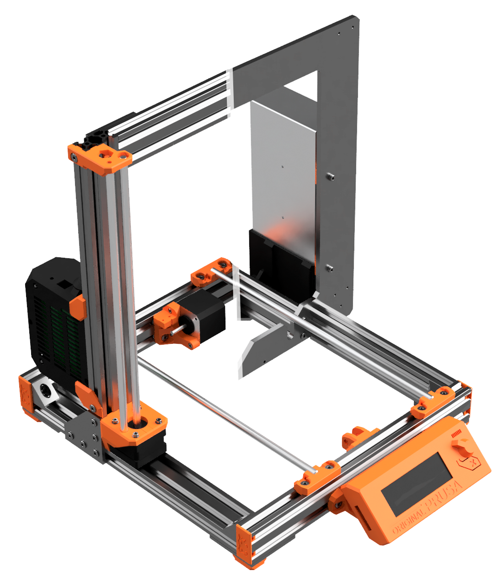
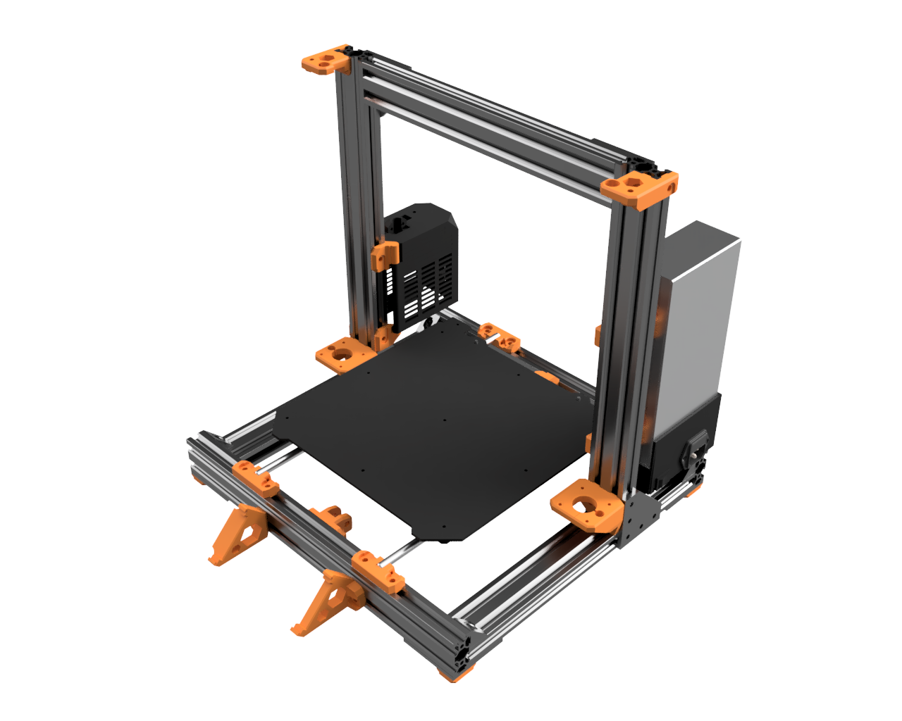
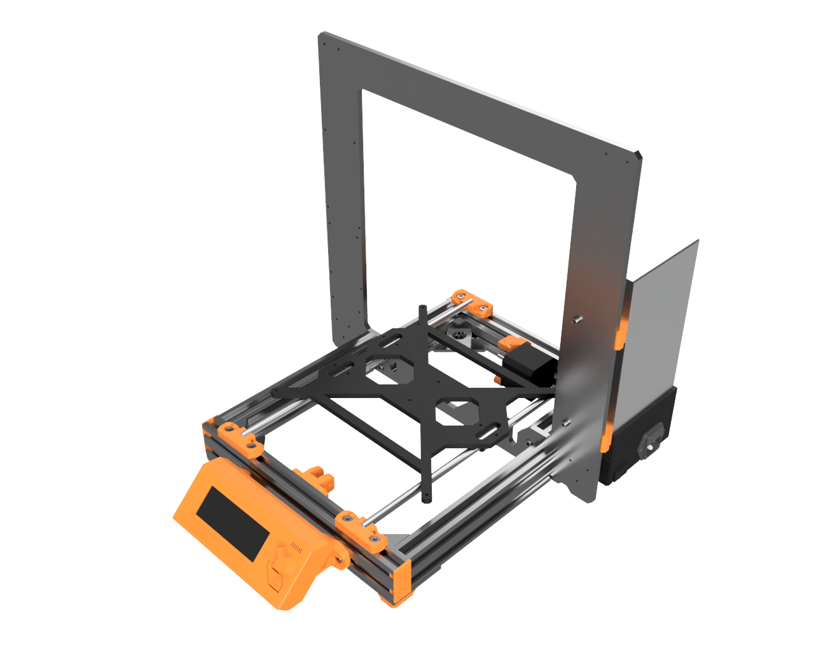
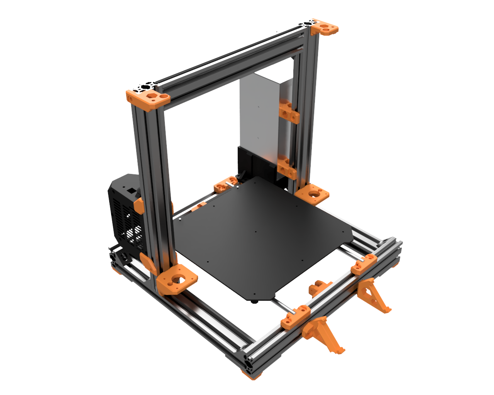
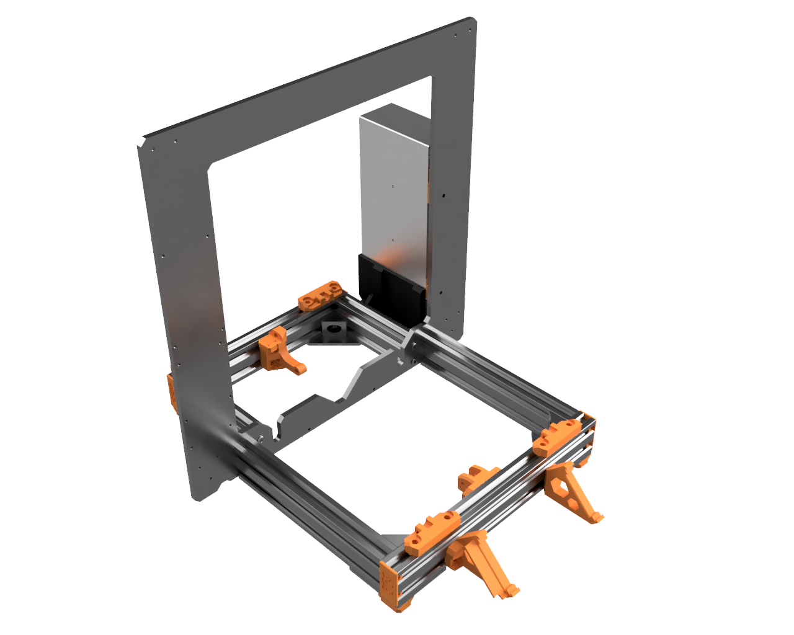

# Prusa i3 Bear Upgrade

This is an aluminum frame conversion for the Prusa i3 MK2, MK2s, MK2.5 and MK3.

Josef PRŮŠA has created numerous of incredible 3D printers and its latest Prusa i3 MK3 is capable of very impressive print quality for a very low price. A huge thanks to him and all its team!

One of the down point of the Prusa i3 MK2 and MK3 is the rigidity of the frame. A very good project has solved those problems by using 3030 extrusion aluminum : Prusa 3030 Haribo Edition. So why another conversion build? Check the next section ;)

## Why another conversion build?

Here are the features that explain why I decided to create another printer upgrade.

* Reduce the number of parts to update your original Prusa printer (no need to print a new RAMBo/EINSY cover nor change any cable, rods or firmware update)
* Compatible with MK2, MK2s MK2.5 and MK3 printers
* Let user choose between two upgrades:
  * Full upgrade: stronger but more expensive
  * Half upgrade: similar to MK3 and cheaper
* Use more aluminum and less printed parts (3D printed parts can crack, they are less reliable and might cost more)
* Use Openbuilds hardware:
  * Single platform of multitude compatible hardware parts (extrusion, plates, brackets, low profile screws...)
  * V-Slot offer more possibilities to printed parts and customisation than T-Slot
  * Open source with powerful community
  * Easy to square and build
  * Worldwide shipping plus several other shops selling these parts
* High level design of 3D printed parts using selective infill, material saving, clean vertical holes...
* Open source by providing STL files, STEP files and Autodesk Fusion 360 project file

## Full And Half upgrades

TO DO

## Current status

Dev

## Links
* All project data and sources are available on my github : [github.com/gregsaun/prusa_i3_bear_upgrade](https://github.com/gregsaun/prusa_i3_bear_upgrade)
* [Openbuilds build page](http://www.openbuilds.org/builds/prusa-i3-bear-upgrade.5661/)
* [Openbuilds forum page](http://www.openbuilds.org/threads/prusa-i3-bear-edition.10274/)
* [Thingiverse page](https://www.thingiverse.com/thing:2562174)

## Sources

Here are a list of sources I used to build this project :

* Prusa : http://www.prusa3d.com
* Prusa 3030 Haribo Edition : https://github.com/PrusaMK2Users/3030_Haribo_Edition
* Openbuilds : https://www.openbuilds.org

Huge thanks to these projects, without them this project can not exist!