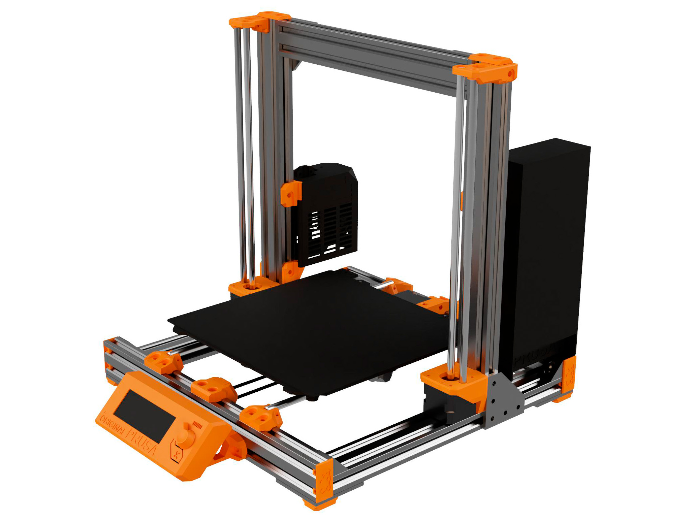

# Prusa i3 Bear Upgrade 2.1

## Introduction

This is a stiffer and more reliable frame for original Prusa i3 MK2S, MK2.5(S) and MK3(S).

Josef PRŮŠA has created numerous of incredible 3D printers capable of great print quality. A huge thanks to him and all its team!

## New features since Bear Upgrade 2.0

Bear Upgrade 2.1 will have a single frame for all Prusa versions (MK2S, MK2.5(S) and MK3(S)). This single frame is exactly the same frame than Full Bear 2.0 MK3 frame.

Bear 2.1 comes with a complete new Y axis with the following features:
  * New belt tensioner.
  * New stiffer Y motor mount.
  * New belt holder with clamping system.
  * Easier assembly of Y motor mount.
  * Creates a similar Y axis construction across all Bear frame.
  * T-nuts are placed were it is easy to swap them.
  * Compatible with E3D-Gates idlers.
  * Helps to reduce Y axis stepper noise for MK3(S).
  * Increase homing accuracy of MK3(S).
  * Y bearing holders are now as standard (not an optional part any more).

:warning: This a work in progress, the current kits sold by our official distributors are not containing the hardware necessary for this upgrade. The Bear Upgrade 2.1 is going to have new features that will require other modifications.

## Compatibility

:bulb: You do not need to upgrade the Bear frame if you come from Full Bear Upgrade 2.0 MK2S or MK2.5 frame to use the new Y axis. It is compatible with Full Bear MK2S and MK2.5 frames thanks to a special belt holder available in the [optional parts](optional_parts/y_belt_holder_for_bear2.0_mk2s_mk2.5_mk2.5s).

:bulb: You do not need to upgrade the Bear frame if you come from Full Bear Upgrade 2.0 MK3 frame.

:warning: The new Y axis is not compatible with any of the existing Prusa Y axis, you have to print all parts of this new Bear Y axis.

## Manual

The manual contains bill of materials (BOM), print settings and assembly instructions.

[Read the manual here :book:](manual/)

## Optional parts

Official and community optional parts [are listed here](optional_parts).

## Where can I purchase the hardware?

#### Official distributors

Official distributors are selling a kit with all screws and extrusions ready for the upgrade, you will only need to print latest 3D printed parts.

All distributors are following [specifications](doc/vslot_specs_tolerances.pdf) to ensure you will have a perfectly squared Bear. All distributors are using professional machines dedicated to cut aluminum extrusion (like CNC machines). In case your extrusion is out of specifications, you can get a replacement for free. We have created a dedicated support channel in case customers have more technical questions or need information for a custom build.

*   
   All3D Makers (US)  
   [all3dmakers.com](http://all3dmakers.com/)  

*   
   Blackfrog (EU)  
   [blackfrog.pl](https://blackfrog.pl)  

*   
   Lecktor (EU)  
   [lecktor.com](http://lecktor.com)  

*   
   Makerparts.ca (CA)  
   [makerparts.ca](http://makerparts.ca)  

*   
   Ooznest (EU)  
   [ooznest.co.uk](https://ooznest.co.uk/)  

*   
   RatRig (EU)  
   [www.ratrig.com](http://www.ratrig.com/)  

By purchasing a kit from official distributors you are supporting the development of the Bear project, thank you very much!

## Community

Here are the places were the Bear project is the most active. Do not hesitate to ask if you have a question :

* Facebook group : [facebook.com/groups/PrusaBearUpgrade](https://www.facebook.com/groups/PrusaBearUpgrade)
* Discord server of "The 602 Wasteland" community : [discordapp.com/invite/hYUjSnW](https://discordapp.com/invite/hYUjSnW)
* GitHub : [github.com/gregsaun](https://github.com/gregsaun)
* Thingiverse : [thingiverse.com/pekcitron](https://www.thingiverse.com/pekcitron)
* Openbuilds community : [openbuilds.com/builds/prusa-i3-bear-upgrade-v2.6428](https://openbuilds.com/builds/prusa-i3-bear-upgrade-v2.6428/)

## Support my work

The Bear project is made possible thanks supporters, you can participate via
  
 [patreon.com/gregsaun](https://www.patreon.com/gregsaun)
  
 [paypal.me/gregsaun](https://www.paypal.me/gregsaun)
  
 You can also send me a tip via [Thingiverse](https://www.thingiverse.com/pekcitron/about) if you prefer that way.

Massive thank you in advance :heart:

## Thank you

Thank you to all my Patreon : 3D-Maniac, Ahmed, Albe Gouws, Alberto Vargas, Anders Svendsen, Andre, Andrew Bingham, Apton Ika, Arnaud CHRISTEL, Austin Vojta, Bas Borgignons, Bearpaw93, Bojan Kopanja, Brian Tibbetts, c, Chris Warkocki, Christopher Lee, Christos Goulas, Corey Dryja, Cristian Toma, Daniele Malinconi, Darren Furniss, David Pesce, David Tyra, Dejan Vozlic, Doug Palmer, Edward Wright, Erich Jermann, Espen Fjellvær Olsen, Evgen, flobler, Gareth Brown, Garrett White, Garth Clardy, Greg3D, Grigori Palamartšuk, Hector Gonzalez, Imperial Terrain, Jason Bao, Jason Marcus, Jimmy Lee, Joan Torner Corrons, Joel Nielsen, Joel Weinberg, Jonathan Ryer, Joseph Mizrachi, Joseph Quan, Josh Carter, Joshua Jones, JTa, Keith Beaul, Kevin Smith, Kyle Shaw, Lewis Cheek, Loïc Dumont, mark smith, Matthew Humphrey, Michal Kapusnik, Miguel Castillo, Mike Phelps, Moody Wood Carving, Nathan Trop, Neofitos Papadopoulos, Nicolas Pottier, Orlando E Moran, Patch Best, Peter Boardman, QcRetro, ra100, RC-CnC, Richard Bateman, robert veline, Ryan Lobbins, SamE0717, Scott Rini, Skyler Weinkauf, sleene, Staffsmith aka Thorben Plath, Stanislav Kljuhhin, Stefan Hilbrich, Stephan Kohls, Stephen Pope, Steven Daglish, Ted Rathkopf, Thom Sturgill, Tom Kogut, Tomáš Vydra, Total Dramatist, Tyler Townes, Warren Schultz

Thank you to David Ogles, Flobler, Jason from LDO Motors, Matthew Humphrey, Nathan Denkin, Orlando from All3DMakers, Saiz, Sleene, Termlimit, Vertigo295 for helping me developing the Bear project.

Thank you to all that have send me a tip on Thingiverse and PayPal.

Thank you to everybody from Facebook group and The 602 Wasteland community.

Thank you for having purchased a kit from an official distributor.

Thank you to all official distributors for taking care of the kits and customers.

Thank you Jason from LDO Motors for the quality manufacturing and relationship.

Thank you Openbuilds for your hardware, community and state of mind.

Thank you for making the community alive with all your comments, issues, pull requests, optional parts, make, pictures, etc.

## Credit, sources and inspiration

Here is list of sources and inspiration :

* Prusa : http://www.prusa3d.com
* Prusa 3030 Haribo Edition : https://github.com/PrusaMK2Users/3030_Haribo_Edition
* Openbuilds : https://www.openbuilds.org
* Prusa i3 Solidworks parts from jzkmath : https://github.com/jzkmath/Original-Prusa-i3/

Massive thanks to these projects, without them this project can not exist!
