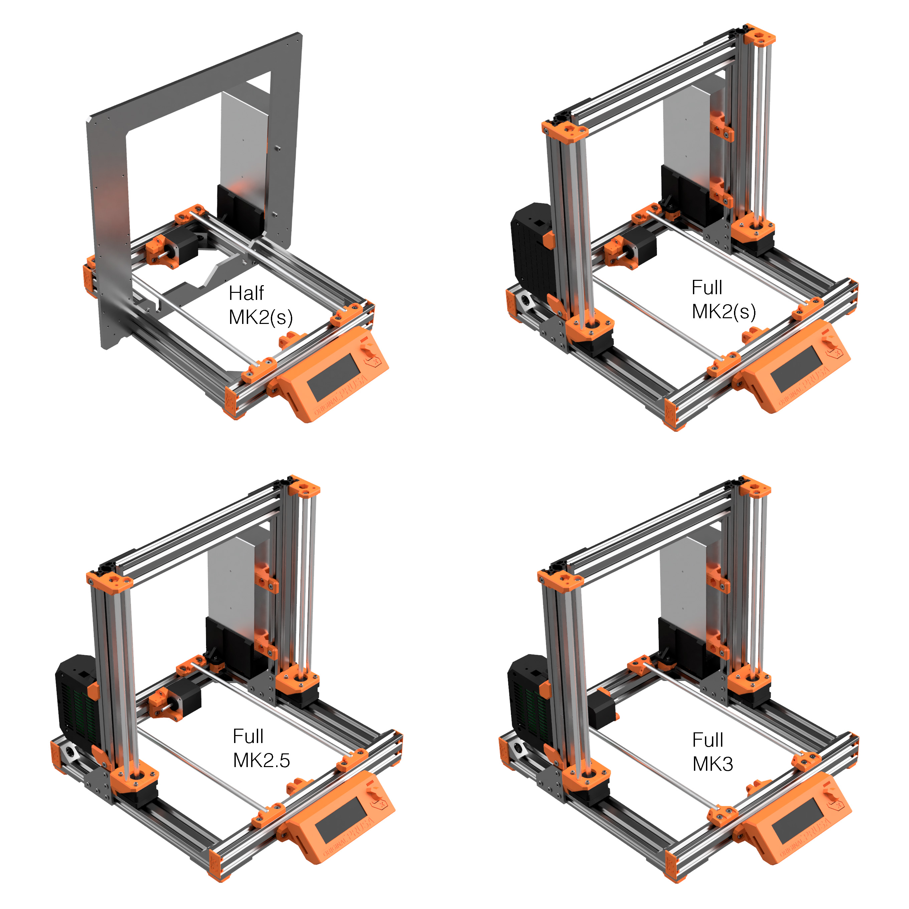

# Prusa i3 Bear Upgrade

## Introduction

This is an aluminum frame conversion for the Prusa i3 MK2, MK2s, MK2.5 and MK3.

Josef PRŮŠA has created numerous of incredible 3D printers and its latest Prusa i3 MK3 is capable of very impressive print quality for a very low price. A huge thanks to him and all its team!

One of the down point of the Prusa i3 MK2 and MK3 is the rigidity of the frame. A very good project has solved those problems by using 3030 extrusion aluminum : Prusa 3030 Haribo Edition. So why another conversion build? Check the next section ;)

## Why another conversion build?

Here are the features that explain why I decided to create another printer upgrade.

* Use as much as possible original parts (no need to print a new RAMBo cover nor change any cable, rods or firmware)
* Compatible with MK2, MK2s MK2.5 and MK3
* Let user choose between two versions :
  * [Half upgrade](half_upgrade/) : similar to MK3 and cheaper
  * [Full upgrade](full_upgrade/) : stronger but more expensive
* Highly detailed manual
* Use more aluminum and less printed parts (3D printed parts can crack and are less reliable)
* Use Openbuilds hardware :
  * Single platform of multitude compatible hardware parts (extrusion, plates, low profile screws...)
  * V-Slot offers more possibilities for printed parts and customisation than T-Slot
  * Open source with powerful community
  * Easy to square and build
  * Worldwide shipping plus several other shops selling these parts
* High level design of 3D printed parts using techniques like selective infill, clean vertical holes, sharp angle...
* Open source by providing STL files, STEP files and Autodesk Fusion 360 project files

## Full And Half upgrades

The Prusa i3 Bear upgrade is proposed in two versions: full or half upgrade.
* [Half upgrade](half_upgrade/) : upgrade your MK2/MK2s/MK2.5 frame to MK3 type
* [Full upgrade](full_upgrade/) : has a redesigned and stronger Z axis for all MK2 and MK3 printers but is more expensive

 &nbsp;&nbsp;&nbsp; 

Here is a comparison table to help you choose :

| | Half Upgrade | Full Upgrade |
|-|:------------:|:------------:|
| Compatibility | MK2, MK2s and MK2.5 | MK2, MK2s, MK2.5 and MK3 |
| Y axis rigidity | &hearts; &hearts; &hearts; &hearts; &hearts; | &hearts; &hearts; &hearts; &hearts; &hearts; |
| Z axis rigidity | &hearts; &hearts; &hearts; | &hearts; &hearts; &hearts; &hearts; &hearts; |
| Noise level | &hearts; &hearts; &hearts; &hearts; | &hearts; &hearts; &hearts; &hearts; |
| Customisation | &hearts; &hearts; &hearts; | &hearts; &hearts; &hearts; &hearts; &hearts; |
| Material cost | $ | $$ |
| Number of V-Slots to cut | 6 (4 different lengths) | 7 (4 different lengths) |
| Number of V-Slots to tap | 4 | 0 |
| Can I place the printer inside an enclosure and PSU outside? | No, PSU rigidify the Z frame | Yes |
| Capability to increase Z axis height? (need customisation) | No | Yes |

Half upgrade use the same vslots and printed for MK2(s) and MK2.5. However, the full upgrade has 3 different versions, one for MK2(s), one for MK2.5 and another one for MK3. You can discover the difference in the [full upgrade page](full_upgrade/).

Several printed parts are shared between all these versions. This makes easier to move from half to full upgrade, or full upgrade MK2 to full upgrade MK3.

Go to [HALF upgrade page](half_upgrade/) or [FULL upgrade page](full_upgrade/).

## Current status

Dev

## Links
* All project data and sources are available on my github : [github.com/gregsaun/prusa_i3_bear_upgrade](https://github.com/gregsaun/prusa_i3_bear_upgrade)
* [Openbuilds build page](http://www.openbuilds.org/builds/prusa-i3-bear-upgrade.5661/)
* [Openbuilds forum page](http://www.openbuilds.org/threads/prusa-i3-bear-edition.10274/)
* [Thingiverse page](https://www.thingiverse.com/thing:2562174)

## Sources

Here are a list of sources I used to build this project :

* Prusa : http://www.prusa3d.com
* Prusa 3030 Haribo Edition : https://github.com/PrusaMK2Users/3030_Haribo_Edition
* Openbuilds : https://www.openbuilds.org

Huge thanks to these projects, without the Bear upgrade can not exist!