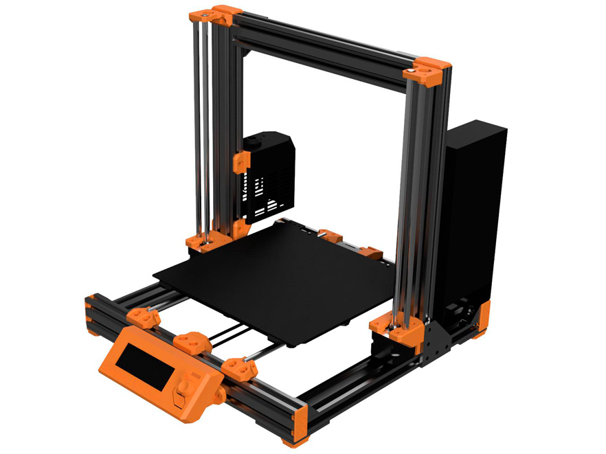

# Prusa i3 Bear Upgrade 2.1

:warning: **This is a development branch, use it at your own risk.** :warning:

## Table of contents
  1. [Introduction](#introduction)
  1. [New features since Bear Upgrade 2.0](#new-features-since-bear-upgrade-20)
  1. [Compatibility](#compatibility)
  1. [Manual](#manual)
  1. [Optional parts](#optional-parts)
  1. [Community](#community)
  1. [Where can I get an official kit?](#where-can-i-get-an-official-kit)
  1. [Partners and contributors](#partners-and-contributors)
  1. [Support my work](#support-my-work)
  1. [Thank you](#thank-you)
  1. [Credit, sources and inspiration](#credit-sources-and-inspiration)

## Introduction

The Bear Upgrade replaces the original [Prusa i3 MK2(S), MK2.5(S) and MK3(S)](https://www.prusa3d.com/) frame with a more rigid and reliable solution. It allows faster prints, increases precision, makes maintenance easier and opens the door to more customization. Plus it looks unique with our coloured frames!

## New features since Bear Upgrade 2.0

New and improved features in Bear Upgrade 2.1:
  * Single frame for all Prusa versions (same frame as Full Bear 2.0 MK3)
  * New stiffer Y axis with tensioner.
  * New stiffer Z axis.
  * Improve X and Y axis homing accuracy.
  * Improve Z axis alignment and assembly.
  * Reduce Y axis stepper noise for MK3(S).
  * Easier assembly of printed parts.
  * Support all Prusa PSU.
  * Shorter LCD supports.
  * Nicer and stronger end caps.
  * Stiffer mounts for Rambo Mini/Einsy cover.
  * Compatible with E3D Gates idlers as well as 9mm belt.

:warning: This a work in progress, the current kits sold by our official distributors are not containing the hardware necessary for this upgrade. The Bear Upgrade 2.1 is going to have new features that will require other modifications.

## Compatibility

This Bear Upgrade 2.1 is compatible with Full Bear Upgrade 2.0 __MK3__ frame. If you do not know which frame you have please check [our FAQ here](https://guides.bear-lab.com/Wiki/Bear_FAQ#Section_Which_Full_Bear_frame_do_I_have).

:bulb: If you have a Full Bear Upgrade 2.0 MK2S or MK2.5 frame you can find compatible parts here: [optional_parts/bear_2.0_upgrade_mk2-2s-2.5-2.5s](optional_parts/bear_2.0_upgrade_mk2-2s-2.5-2.5s).

:warning: The new Y and Z axis are not compatible with any of the existing Prusa or Bear 2.0 parts. You have to update all parts from Bear 2.1.

## Manual

The manual contains bill of materials (BOM), print settings and assembly instructions.

[Read the manual here :book:](manual/)

## Optional parts

Official and community optional parts [are listed here](optional_parts).

## Community

Here are the places were the Bear project is the most active. Do not hesitate to ask if you have a question :

* Facebook group : [facebook.com/groups/PrusaBearUpgrade](https://www.facebook.com/groups/PrusaBearUpgrade)
* Discord server of "The 602 Wasteland" community : [discordapp.com/invite/hYUjSnW](https://discordapp.com/invite/hYUjSnW)
* GitHub : [github.com/gregsaun](https://github.com/gregsaun)
* Thingiverse : [thingiverse.com/pekcitron](https://www.thingiverse.com/pekcitron)
* Openbuilds community : [openbuilds.com/builds/prusa-i3-bear-upgrade-v2.6428](https://openbuilds.com/builds/prusa-i3-bear-upgrade-v2.6428/)

## Where can I get an official kit?

Official distributors are selling a kit with all screws and extrusions ready for the upgrade, you will only need to print latest 3D printed parts.

All distributors are following [specifications](doc/vslot_specs_tolerances.pdf) to ensure you will have a perfectly squared Bear. All distributors are using professional machines dedicated to cut aluminum extrusion (like CNC machines). In case your extrusion is out of specifications, you can get a replacement for free. We have created a dedicated support channel in case customers have more technical questions or need information for a custom build.

  *   
     All3D Makers (US)  
     [all3dmakers.com](http://all3dmakers.com/)  

  *   
     Blackfrog (EU)  
     [blackfrog.pl](https://blackfrog.pl)  

  *   
    Lecktor (EU)  
    [lecktor.com](http://lecktor.com)  

  *   
    Makerparts.ca (CA)  
    [makerparts.ca](http://makerparts.ca)  

  *   
    Ooznest (EU)  
    [ooznest.co.uk](https://ooznest.co.uk/)  

  *   
    RatRig (EU)  
    [www.ratrig.com](http://www.ratrig.com/)  

By purchasing a kit from official distributors you are supporting the development of the Bear project, thank you very much!

## Partners and contributors

 &nbsp;[LDO Motors](http://ldomotors.com/) is the manufacturer of the Original Bear upgrade kit for all distributors with the exception of [RatRig](http://www.ratrig.com/).

 &nbsp;[3DFused](https://3dfused.com/) is helping the Bear development team with linear motion knowledge and will sell custom linear rail kit for the Bear Upgrade.

Grégoire Saunier is the inventor of the Original Bear Upgrade frame and extruder.

Florian Däubler, Josh Jones and Stefan Maue are active developers supporting the work of Grégoire Saunier.

Barry Danks, David Ogles, Florian Däubler, Josh Jones, Nathan Denkin, Orlando from All3DMakers, Termlimit are admins of the Bear community and help with translations.

## Support my work

The Bear project is made possible thanks supporters, you can participate via
  
 [patreon.com/gregsaun](https://www.patreon.com/gregsaun)
  
 [paypal.me/gregsaun](https://www.paypal.me/gregsaun)
  
 You can also send me a tip via [Thingiverse](https://www.thingiverse.com/pekcitron/about) if you prefer that way.

Massive thank you in advance :heart:

## Thank you

Thank you to all my Patreon : 3D-Maniac, Ahmed, Albe Gouws, Alberto Vargas, Anders Svendsen, Andre, Andrew Bingham, Apton Ika, Arnaud CHRISTEL, Bas Borgignons, Bearpaw93, Bojan Kopanja, Borja Gutierez Yañez, Brad Craig, Brendon Buhler, Chris Jackson, Chris Warkocki, Christopher Lee, Christos Goulas, Corey Dryja, Corrado, Cristian Toma, Daniele Malinconi, Darren Furniss, David F Morrison II, David Pesce, David Tyra, Dejan Vozlic, Doug Palmer, Edward Wright, Emiliano Vignali, Erich Jermann, Espen Fjellvær Olsen, Evgen, flobler, Fredrik Id, Gareth Brown, Garrett White, Garth Clardy, Greg3D, Grigori Palamartšuk, Hector Gonzalez, Illia Tsariuk, Imperial Terrain, J.D. sloot, Jack Emilsen, Jacob Leonard, Jan Andersen, Jason Bao, Jason Marcus, Jimmy Lee, JimmySnails, Joan Torner Corrons, Joel Nielsen, Joel Weinberg, Jonathan Ryer, Jonny Menkakow, Joseph Mizrachi, Joseph Quan, Josh Carter, Joshua Jones, JTa, Keith Beaul, Keith Bennett, Ken Waters, Kevin Smith, Kim Schauss, Kristof Spiszak, Kyle Rothrock, Lionel Saëz, Loïc Dumont, Luke Turner, Magnus Pfeffer, Mark A, Merijn van Mourik, Michael Wang, Michal Kapusnik, Michiel Plaisier, Miguel Castillo, Mike Phelps, Moody Wood Carving, Neofitos Papadopoulos, Nicolas Pottier, Orlando E Moran, Oscar Padilla, Patch Best, Phil S., QcRetro, ra100, Rasmus Baes, RC-CnC, Richard Bateman, robert veline, Ryan Lenny, Ryan Lobbins, SamE0717, Satoshi Takanashi, Scott Rini, Serkan Aksu, Settle, Shawn Chronister, Skyler Weinkauf, sleene, Staffsmith aka Thorben Plath, Stanislav Kljuhhin, Stefan Hilbrich, Stephan Kohls, Stephen Pope, Steve Peterson, Steven Daglish, Stig Jøran Moen, Ted Rathkopf, Thom Sturgill, Tom Kogut, Tomáš Vydra, Total Dramatist, Trae LaPole, Tyler Townes, Víctor Martínez, Warren Schultz, Wes Warner.

Thank you to David Ogles, Flobler, Jason from LDO Motors, Matthew Humphrey, Nathan Denkin, Orlando from All3DMakers, Saiz, Sleene, Termlimit, Vertigo295 for helping me developing the Bear project.

Thank you to all that have send me a tip on Thingiverse and PayPal.

Thank you to everybody from Facebook group and The 602 Wasteland community.

Thank you for having purchased a kit from an official distributor.

Thank you to all official distributors for taking care of the kits and customers.

Thank you Jason from LDO Motors for the quality manufacturing and relationship.

Thank you Openbuilds for your open source hardware and community.

Thank you for making the community alive with all your comments, issues, pull requests, optional parts, make, pictures, etc.

## Credit, sources and inspiration

Here is list of sources and inspiration :

  * Original Prusa i3 printers : [prusa3d.com](http://www.prusa3d.com).
  * Prusa 3030 Haribo Edition : [github.com/PrusaMK2Users/3030_Haribo_Edition](https://github.com/PrusaMK2Users/3030_Haribo_Edition).
  * Openbuilds for the invention of opensource vslot extrusions : [openbuilds.org](https://www.openbuilds.org).
  * Prusa i3 Solidworks parts from jzkmath : [github.com/jzkmath/Original-Prusa-i3](https://github.com/jzkmath/Original-Prusa-i3/).
  * Roy Henriksson for the inspiration of its Y axis tensioner : [thingiverse.com/thing:3502543](https://www.thingiverse.com/thing:3502543).
  * Vecko Kojchevski for its Z axis parts and feedback : [thingiverse.com/vekoj/designs](https://www.thingiverse.com/vekoj/designs).

Massive thanks to these projects, without them this project can not exist!
