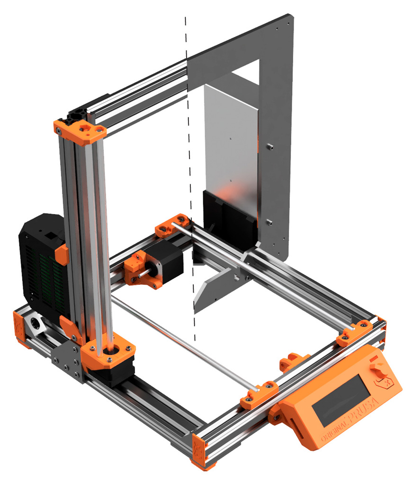
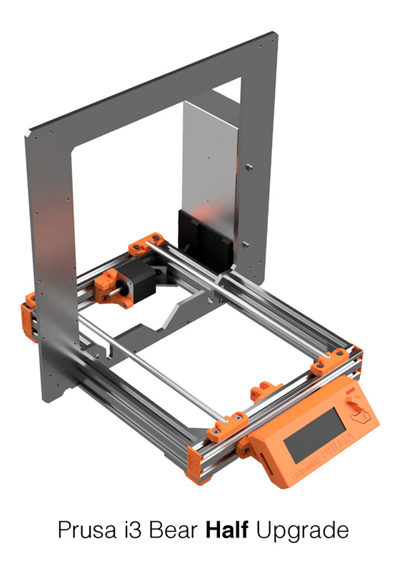
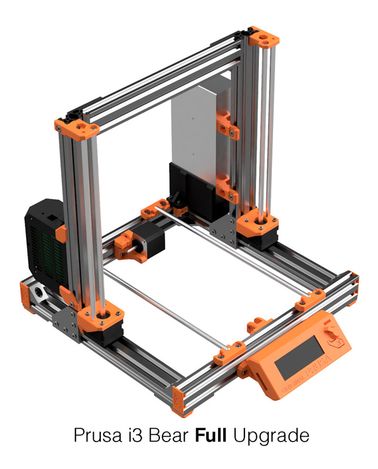
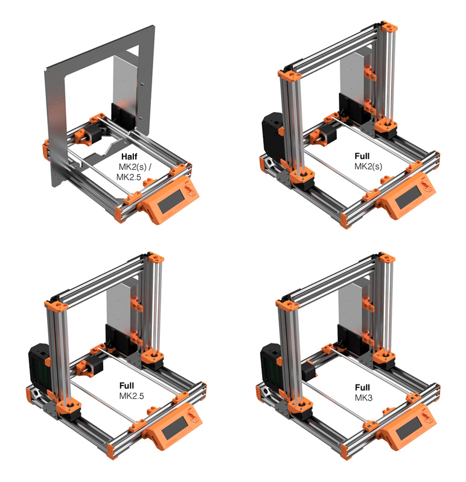

# Prusa i3 Bear Upgrade V2.0

## Introduction

This is an aluminum frame conversion for the Prusa i3 MK2, MK2s, MK2.5 and MK3.

Josef PRŮŠA has created numerous of incredible 3D printers and its latest Prusa i3 MK3 is capable of very impressive print quality for a very low price. A huge thanks to him and all its team!

One of the down point of the Prusa i3 MK2 and MK3 is the rigidity of the frame. A very good project has solved those problems by using 3030 extrusion aluminum : Prusa 3030 Haribo Edition. So why another conversion build? Check the next section ;)

## Why another conversion build?

Here are the features that explain why I decided to create another printer upgrade.

* Use as much as possible original parts (no need to print a new RAMBo cover nor change any cable, rods or firmware)
* Compatible with MK2, MK2s MK2.5 and MK3
* Let user choose between two versions :
  * [Half upgrade](half_upgrade/) : similar to MK3 and cheaper
  * [Full upgrade](full_upgrade/) : stronger but more expensive
* Highly detailed manual
* Use more aluminum and less printed parts (3D printed parts can crack and are less reliable)
* Use Openbuilds hardware :
  * Single platform of multitude compatible hardware parts
  * V-Slot offers more possibilities for printed parts and customisation than T-Slot
  * Open source with powerful community
  * Easy to square and build
  * Worldwide shipping plus several other shops selling these parts
* Other type of aluminum extrusions can be supported thanks to parametric design (check Fusion 360 files)
* 3D printed parts designed using advanced techniques like selective infill, clean vertical holes, sharp angle...
* Open source by providing STL, STEP and Autodesk Fusion 360 files

## Full And Half upgrades

The Prusa i3 Bear upgrade is proposed in two versions: full or half upgrade.
* [Half upgrade](half_upgrade/) : upgrade your MK2/MK2s/MK2.5 frame to MK3 type
* [Full upgrade](full_upgrade/) : has a redesigned and stronger Z axis for all MK2 and MK3 printers but is more expensive

 &nbsp;&nbsp;&nbsp; 

Here is a comparison table to help you choose :

| | Half Upgrade | Full Upgrade |
|-|:------------:|:------------:|
| Compatibility | MK2, MK2s and MK2.5 | MK2, MK2s, MK2.5 and MK3 |
| Y axis rigidity | :hearts: :hearts: :hearts: :hearts: :hearts: | :hearts: :hearts: :hearts: :hearts: :hearts: |
| Z axis rigidity | :hearts: :hearts: :hearts: | :hearts: :hearts: :hearts: :hearts: :hearts: |
| Noise level | :hearts: :hearts: :hearts: :hearts: | :hearts: :hearts: :hearts: :hearts: |
| Customisation | :hearts: :hearts: :hearts: | :hearts: :hearts: :hearts: :hearts: :hearts: |
| Material cost | :moneybag: | :moneybag: :moneybag: |
| Number of V-Slots to cut | 6 (4 different lengths) | 7 (4 different lengths) |
| Number of V-Slots to tap | 4 | 0 |
| Can I place the printer inside an enclosure and PSU outside? | :x: PSU rigidify the Z frame | :heavy_check_mark: |
| Capability to increase Z axis height? (need customisation) | :x: | :heavy_check_mark: |

Half upgrade use the same v-slots and printed part for MK2(s) and MK2.5. However, the full upgrade has 3 different versions, one for MK2(s), one for MK2.5 and another one for MK3. You can discover the difference in the [full upgrade page](full_upgrade/).

Several printed parts are shared between all these versions. This makes easier to move from half to full upgrade, or full upgrade MK2 to full upgrade MK3.

Go to [HALF upgrade page](half_upgrade/) or [FULL upgrade page](full_upgrade/).

## Where can I purchase the hardware?

#### Official distributors

Here are the official distributors of the Bear Upgrade kit. All distributors are following [tolerances](doc/vslot_specs_tolerances_0.2.pdf) to ensure quality cuts and we are working actively together to make every customers happy.

*   
   All3D Makers (US)  
   [all3dmakers.com](http://all3dmakers.com/)  

*   
   Blackfrog (EU)  
   [blackfrog.pl](https://blackfrog.pl)  

*   
   Makerparts.ca (CA)  
   [makerparts.ca](http://makerparts.ca)  

*   
   RatRig (EU)  
   [www.ratrig.com](http://www.ratrig.com/)  

#### Openbuilds distributors
You can also purchase parts separately worldwide. Checkout my list of distributors here : [Openbuilds stores list](doc/openbuilds_stores_list.md)

## Community And Support

* Dedicated Facebook group : [facebook.com/groups/PrusaBearUpgrade](https://www.facebook.com/groups/PrusaBearUpgrade)
* Openbuilds community : [openbuilds.com/builds/prusa-i3-bear-upgrade-v2.6428](https://openbuilds.com/builds/prusa-i3-bear-upgrade-v2.6428/). Be careful when you join OpenBuilds, you will be soon tempted by building a CNC or a Laser machine!
* You can also open an issue on [GitHub](https://github.com/gregsaun/prusa_i3_bear_upgrade/) if you prefer or add a comment on my [My Thingiverse](https://www.thingiverse.com/thing:2808408)

## Optional parts

Do you want to make this printer ever better, checkout the [Optional Parts](optional_parts.md)

## Feedbacks from users

Some feedbacks from users that built the half upgrade v1 :

> _"I'm really happy. It's really great.It works really fine. It's a professional update. I was searching for a mk3 prusa frame update and I find this"_

> _"Excellent with instructions, this was like buying a Prusa kit all over again, only better"_

> _"Your frame idea made the machine a lot sturdier"_

> _"It seems printing noise has reduced significantly after upgrade"_

> _"Amazing work on the detail and on the machine"_

> _"That frames makes it into totally different beast!"_

> _"It's a professional well made update. And the manual it's really easy to follow"_

> _"Very detailed work, are you sure you dont want to take on the role of the new Josef Prusa ?? I mean the designs are just amazing"_

Huge THANKS to all of you! :sparkling_heart:

## Links

* Help me continue this work by supporting me via [my Patreon :heart:](https://www.patreon.com/gregsaun). (I have tons of new idea)
* [Facebook group](https://www.facebook.com/groups/PrusaBearUpgrade)
* [GitHub Project Page](https://github.com/gregsaun/prusa_i3_bear_upgrade/)
* [Openbuilds forum page](https://openbuilds.com/threads/prusa-i3-bear-upgrade-v2.11626/)
* [Openbuilds build page](https://openbuilds.com/builds/prusa-i3-bear-upgrade-v2.6428/)
* [Thingiverse page](https://www.thingiverse.com/thing:2808408)

## Thank you

Thank you for all people helping me on this project.

Thank you Openbuilds for your hardware and community.

Special thanks to DoItWithSmile (jay3D), kabar03, xequtor and fishmsk, karlosek for actively helping me and for their feedbacks.

## Sources

Here are a list of sources I used to build this project :

* Prusa : http://www.prusa3d.com
* Prusa 3030 Haribo Edition : https://github.com/PrusaMK2Users/3030_Haribo_Edition
* Openbuilds : https://www.openbuilds.org
* Prusa i3 Solidworks parts from jzkmath : https://github.com/jzkmath/Original-Prusa-i3/

Huge thanks to these projects, without them this project can not exist!