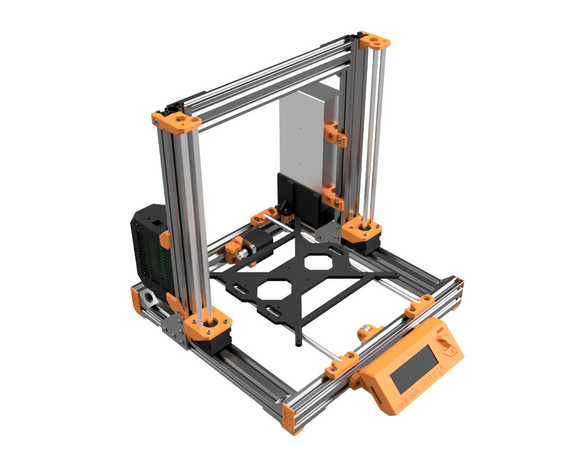
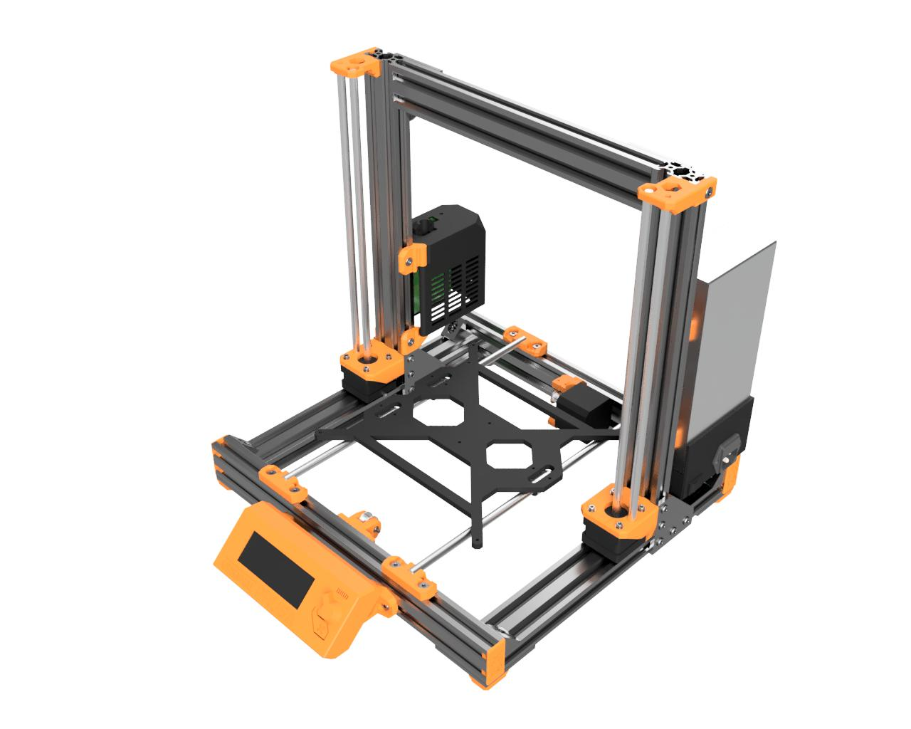
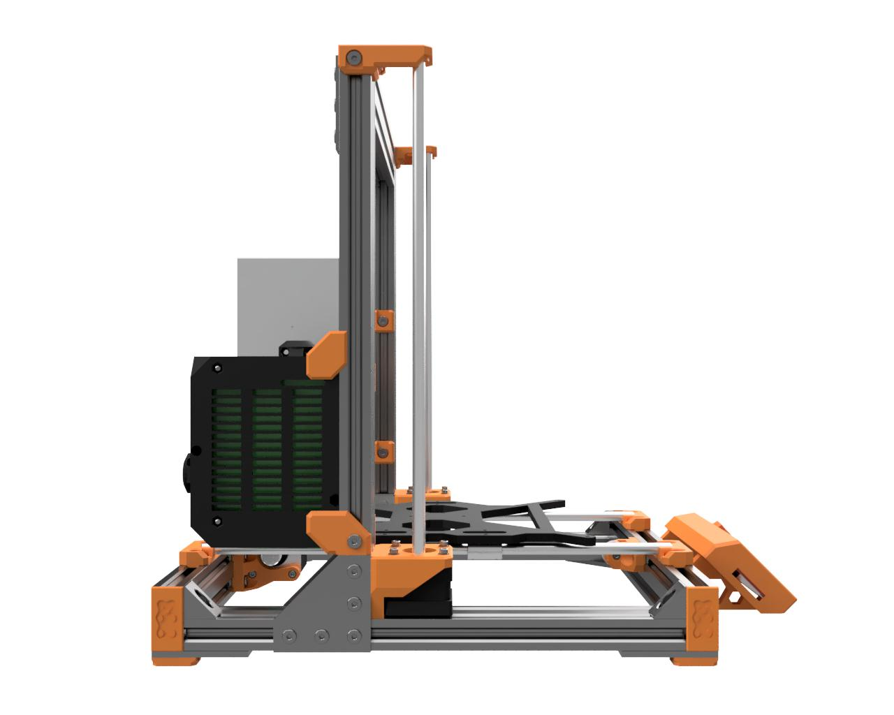
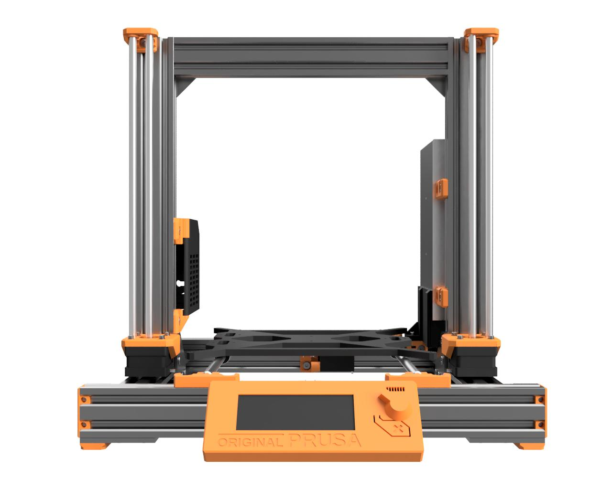
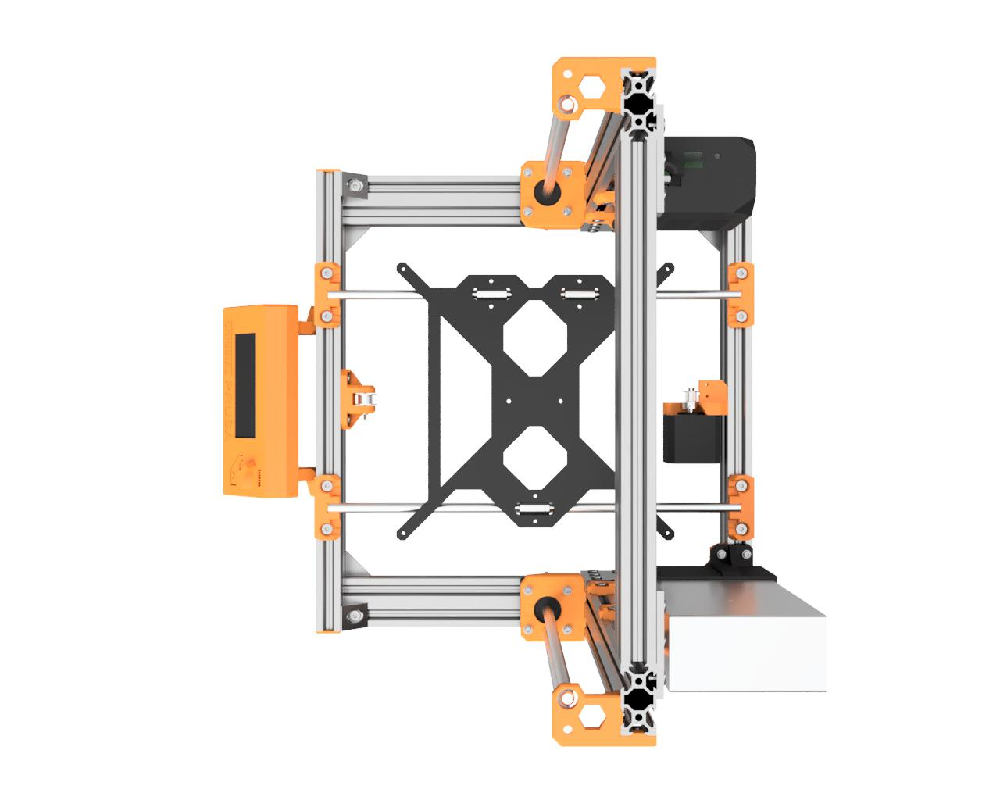
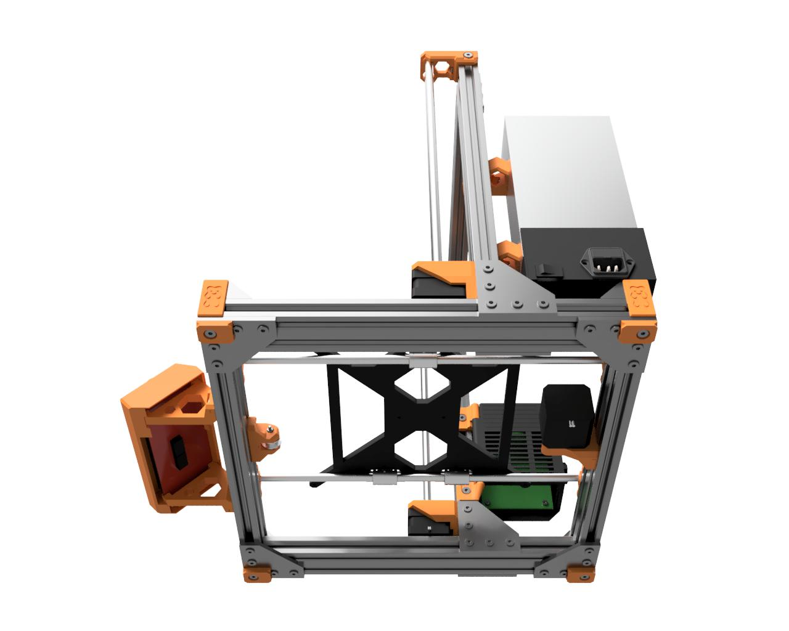
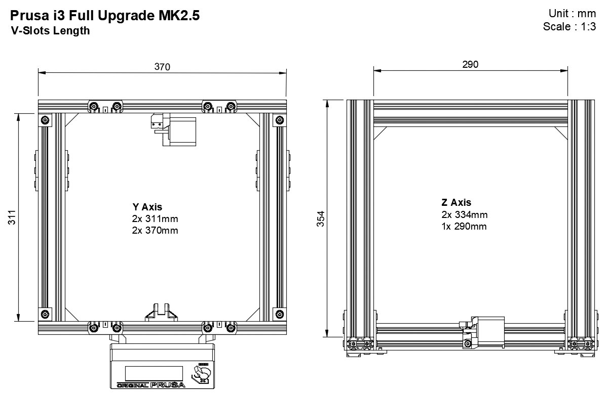
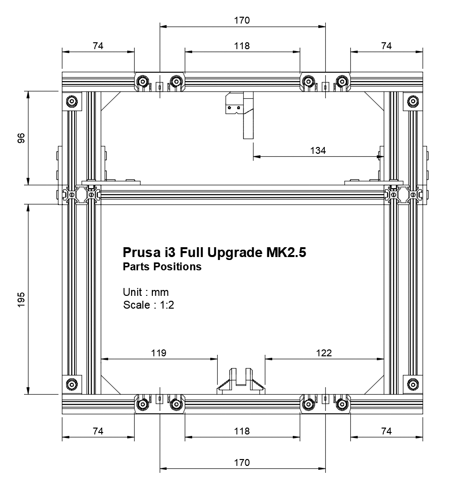

# Prusa i3 Bear Full Upgrade MK2.5

This is the FULL version of the Prusa i3 Bear upgrade MK2.5, a much stronger frame for your Prusa printer. If you are searching for a cheaper and simpler upgrade check out [half upgrade version](/half_upgrade/) or spot the differences on the [home page](https://github.com/gregsaun/prusa_i3_bear_upgrade/tree/dev/).

## Features

* Stronger and quieter
* Easier to maintain and customise
* Use as much as possible original parts (no need to print a new RAMBo cover nor change any cable, rods or firmware)
* Highly detailed manual
* Use more aluminum and less printed parts (3D printed parts can crack and are less reliable)
* Use Openbuilds hardware :
  * Single platform of multitude compatible hardware parts (extrusion, plates, low profile screws...)
  * V-Slot offer more possibilities to printed parts and customisation than T-Slot
  * Open source with powerful community
  * Easy to square and build
  * Worldwide shipping plus several other shops selling these parts
* High level design of 3D printed parts using selective infill, material saving, clean vertical holes...
* Open source by providing STL files, STEP files and Autodesk Fusion 360 project file
* Z motors can be easily removed for maintenance 
* Fix some dimensional errors of Z axis from Original Prusa i3

## Manual

The manual contains build of material, preparing frame and v-slots, print settings and assembly instructions.

[Read it here](manual/)

## Purchase Openbuilds V-Slots

Here is a list of [Openbuilds stores](/doc/openbuilds_stores_list.md). Note that few stores are selling a pre-cut V-Slots.

## Images

## Current status

dev
