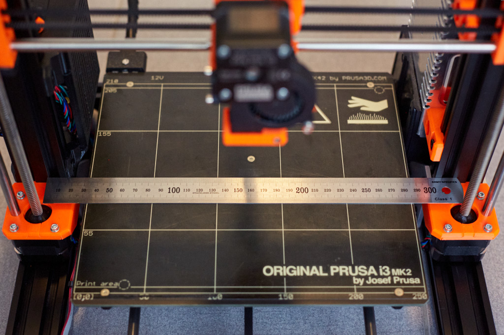
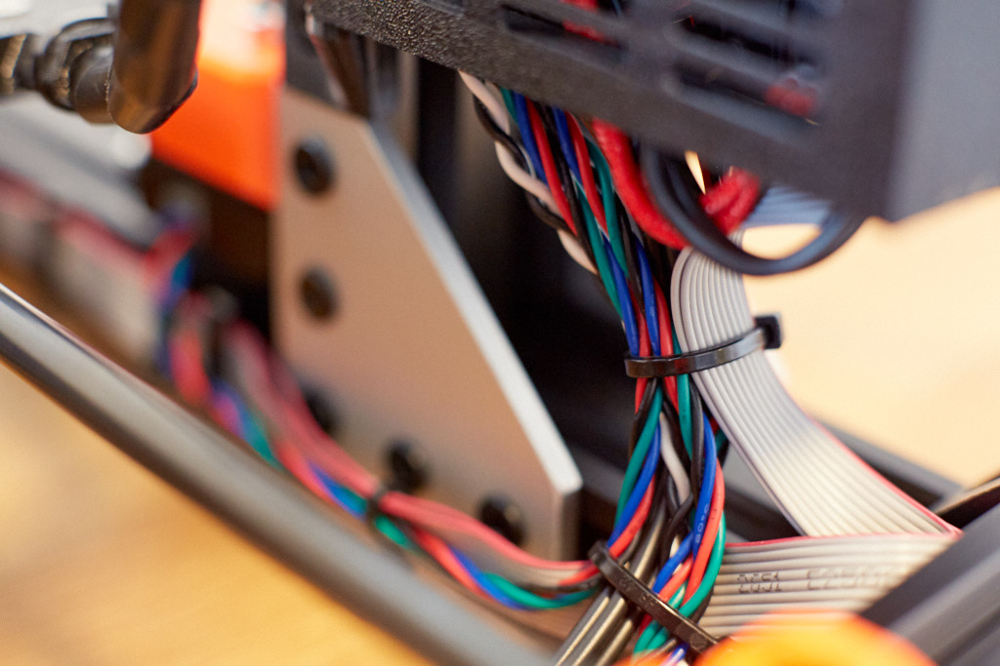

# Prusa i3 Full Upgrade MK2.5

## Assembly Instructions

### Step 18

#### Parts  

* 6x cable_clip_lcd
* 5x cable_clip_round
* 3x cable_clip_ziptie
* Zip ties

#### Assembly

1. Follow **step 12 only** from ["8. Electronic Assembly" from original Prusa MK2S manual](http://manual.prusa3d.com/Guide/8.+Electronics+assembly/279?lang=en#s4764) to begin cable assembly.
1. Follow steps 12 and above of the chapter ["6. Electronic Assembly" from original Prusa MK2.5 manual](http://manual.prusa3d.com/Guide/6.+Electronics/573?lang=en#s9973) to finish wiring all cables
1. Guide LCD cables using 6 cable_clip_lcd as seen on figure 18.1
1. Use other cable clips to guide other cables as highlighted in figure 18.2 to 18.5

\
*fig 18.1*

\
*fig 18.2*

\
*fig 18.3*

\
*fig 18.4*

\
*fig 18.5*

#### [Previous Step](step17.md) &nbsp;&nbsp;&nbsp; [Next Step](step19.md)
