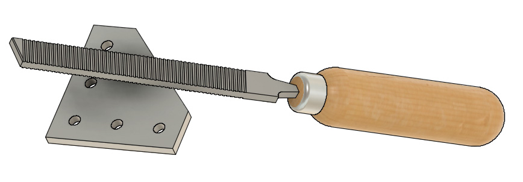
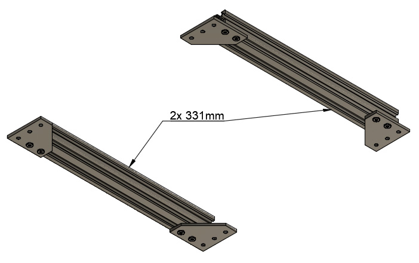
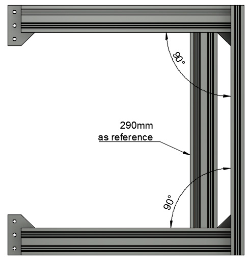

# Prusa i3 Full Upgrade MK2(s)

## Assembly Instructions

### Step 1

#### Parts

* 2x 311mm V-Slots
* 1x 370mm V-Slots
* 4x 90° joining plates
* 12x M5x10mm screws
* 24x Tee nuts

#### Assembly

1. If you did not get your 90° joining plates from RatRig, file sharp edges on the diagonal of 90° joining plates (figure 1.1). A small chamfer is enough, this just to avoid scratching cables and it will be useful for the next step as well
1. Assemble 90° joining plates to the two 311mm v-slots as seen on figure 1.2 (with 8x M5x10 screws and 8x tee nuts). Do not tighten M5 screws yet
1. Add 1x 370mm v-slot vertically as seen on figure 1.3 (with 4x M5x10 screws and 4x tee nuts). Do not tighten M5 screws yet
1. Add 3 tee nuts on each side of the 311mm v-slots (12x tee nuts in total) as seen on figure 1.4

  :warning: this step is very important, double check you have use 12 Tee nuts (3 on each side of each 311 V-Slots as seen on             figure 1.4). If you forget this step, you will have to restart build from scratch !  

\
*fig 1.1*

\
*fig 1.2*

\
*fig 1.3*

\
*fig 1.4*

#### [Next Step](step02.md)
