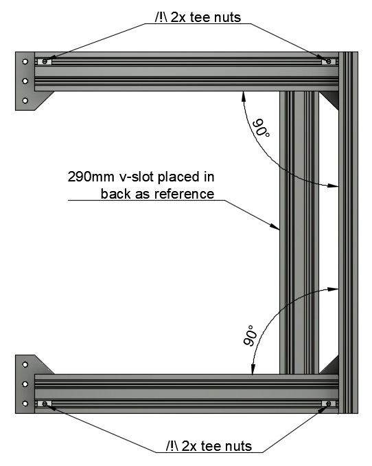
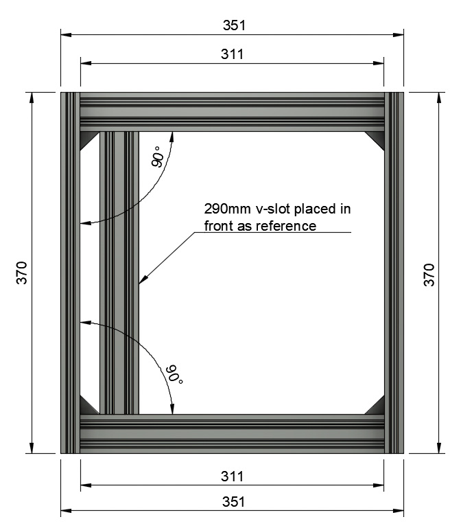

# Prusa i3 Full Upgrade MK2(s)

## Assembly Instructions

### Step 1

#### Parts  

* 1x 370mm V-Slots
* 1x 290mm V-Slots (used for distance reference)
* 4x M5x10mm screws
* 4x Tee nuts

#### Assembly

1. Ensure the 290mm v-slot does not have sharp angle where it as been cut. We will use it as reference and it could mark your v-slots (specially black ones). If this is the case use a file to smooth a bit the sharp angles
1. Place the 290mm on the back between the 2x331mm v-slots as seen on figure 2.1. Ensure there is no space between rods.
1. Square and tight strongly the back (8x M5 screws). 
   :warning: this step is very important, double check everything is perfectly square
1. Carefully remove the 290mm v-slot
1. Repeat step 4 and 5 to assemble the last 370mm v-slot as seen on figure 2.2. 
   :warning: this step is very important, double check everything is perfectly square
1. Carefully remove the 290mm v-slot
1. :warning: Take the time to double check these points :
    * Everything is perfectly aligned and squared
    * All lengths corresponds to figure 2.2
    * The distance between the two 311mm v-slots corresponds to the 290mm v-slot in front, back and middle
    * All screws have been strongly tightened

\
*fig 2.1*

\
*fig 2.2*

#### [Next Step](step03.md)
