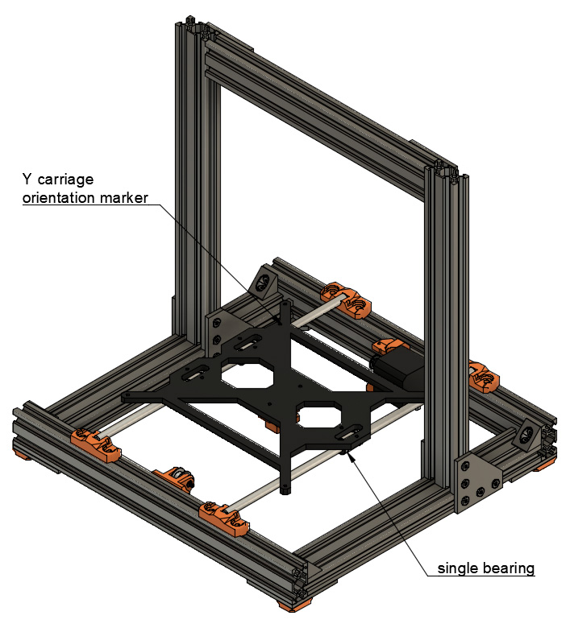

# Prusa i3 Full Upgrade MK2(s)

## Assembly Instructions

### Step 9

#### Parts  

* 1x heated bed assembly
* 4x zip ties

#### Assembly

1. Unclip the front of y smooth rods
1. Slide carefully the Y carriage. Ensure correct orientation as highlighted in figure 9.1
1. Clip again Y smooth rods and add zip ties
1. Ensure zip ties are not touching the bed and y carriage
1. If the bed does not slide smoothly, improve rod spacing/angle
1. Mount the Y belt
1. Take your time to perfectly align position of y_idler and y_motor_mount to have a perfect belt alignment

\
*fig 9.1*

#### [Previous Step](step08.md) &nbsp;&nbsp;&nbsp; [Next Step](step10.md)
