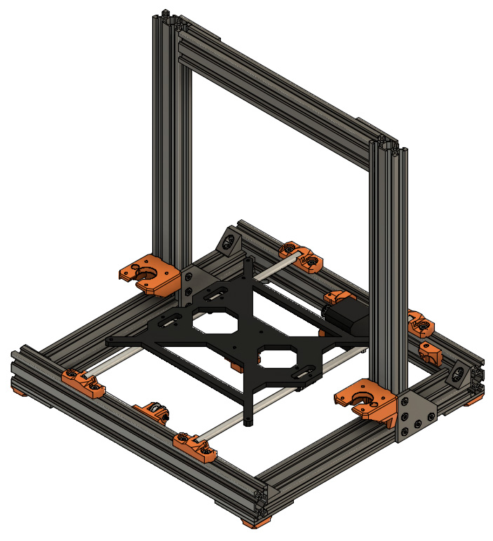
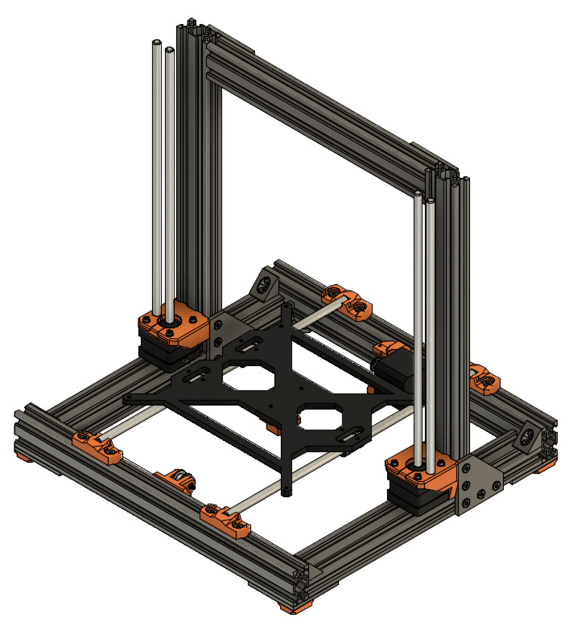

# Prusa i3 Full Upgrade MK2(s)

## Assembly Instructions

### Step 11

#### Parts  

* 2x z_motor_fronts
* 8x M3x12mm screws
* 8x M3 washers
* 1x X axis
* 2x Z motors
* 2x Z smooth rods (320mm)

#### Assembly

:heavy_exclamation_mark: X axis is not visible in these figures and will not be visible in the following ones

1. Assemble X axis on both Z motors (move it approximately in the middle of Z axis)
1. Use 8x M3 washers, 8x M3x12 screws and 2x z_motor_fronts to mount Z motors on the z_motor_mounts (with the X axis mounted)
1. Ensure the motor cables are facing the Y smooth rods (figure 11.1)
1. Push Z smooth rods carefully in the holes until your hear them touching the motors (figure 11.2)

\
*fig 11.1*

\
*fig 11.2*

#### [Previous Step](step10.md) &nbsp;&nbsp;&nbsp; [Next Step](step12.md)
