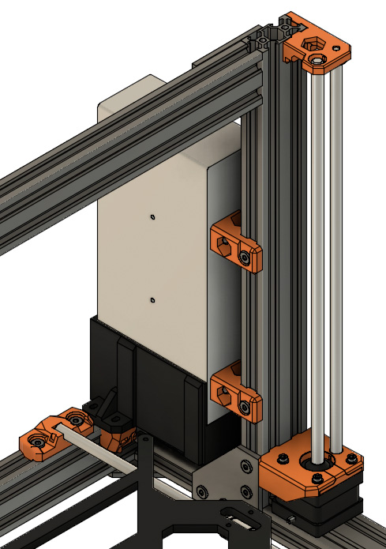
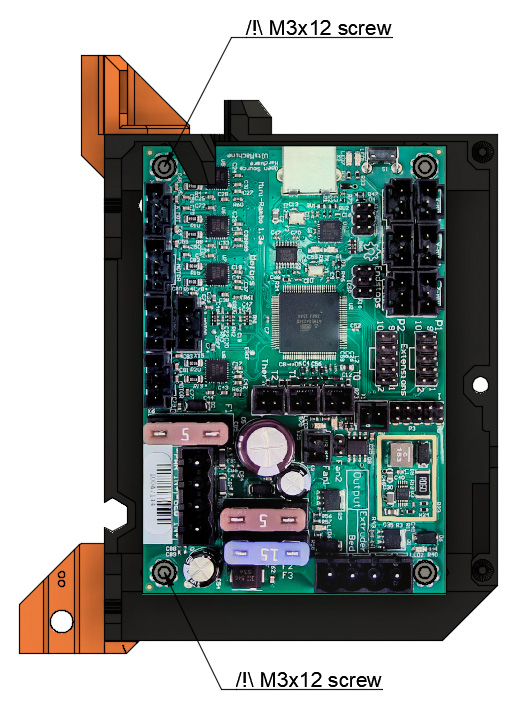

# Prusa i3 Full Upgrade MK2(s)

## Assembly Instructions

### Step 15

#### Parts  

* 1x rambo_base_lower_mount
* 1x rambo_base_upper_mount
* 1x M3x12 screws
* 1x RAMBo cover with RAMBo mini PCB mounted inside
* 2x M5x8 screws
* 2x Tee nuts

#### Assembly

:heavy_exclamation_mark: X axis cables are not visible in these figures and will not be visible in the following ones

1. Remove the 2x M3x10 screw from the left of the RAMBo mini PCB as highlighted in figure 15.1. Remove M3 nuts as well
1. Insert rambo_base_upper_mount on top and rambo_base_lower_mount on bottom of the cover as seen in figure 15.2
1. Screw carefully 2x M3x12 on the two holes in left as highlighted in figure 15.3 
   :warning: do not reuse M3x10 screws previously removed
1. Pass the X motor cable in the appropriate hole (figure 15.4) and fix the RAMBo cover to the frame using 2x M5x8 screws et 2x tee nuts
1. Ensure that the bottom of the rambo_base_lower_mount is touching the top of 90° joining plate

\
*fig 15.1*

\
*fig 15.2*

\
*fig 15.3*

\
*fig 15.4*

#### [Previous Step](step14.md) &nbsp;&nbsp;&nbsp; [Next Step](step16.md)
