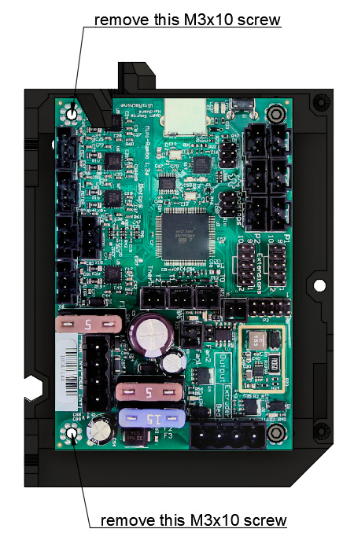

# Prusa i3 Full Upgrade MK2(s)

## Assembly Instructions

### Step 16

#### Parts  

* 1x rambo_lid_lower_hinge
* 1x rambo_lid_upper_hinge
* 1x RAMBo cover door
* 2x M5x8 screws
* 2x Tee nuts

#### Assembly

1. Mount the rambo_lid_lower_hinge on the frame as seen in figure 16.1 with 1x M5x8 and 1x tee nut
1. Ensure that the bottom of the rambo_lid_lower_hinge is touching the top of 90° joining plate
1. Mount the RAMBo cover door and rambo_lid_upper_hinge on the frame as seen in figure 16.2 with 1x M5x8 and 1x tee nut

\
*fig 16.1*

\
*fig 16.2*

#### [Previous Step](step15.md) &nbsp;&nbsp;&nbsp; [Next Step](step17.md)
