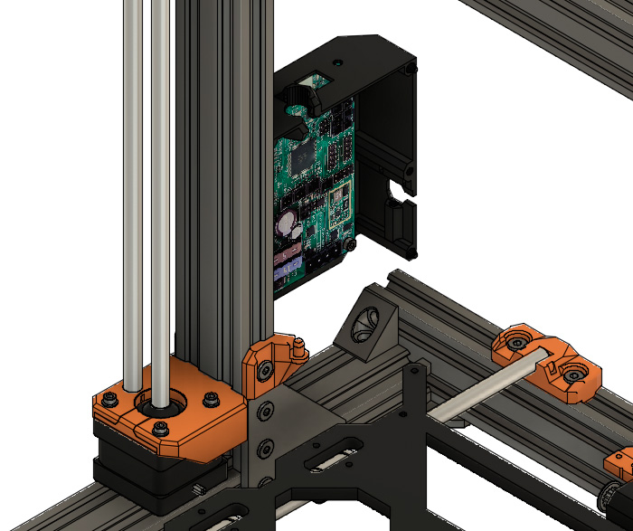
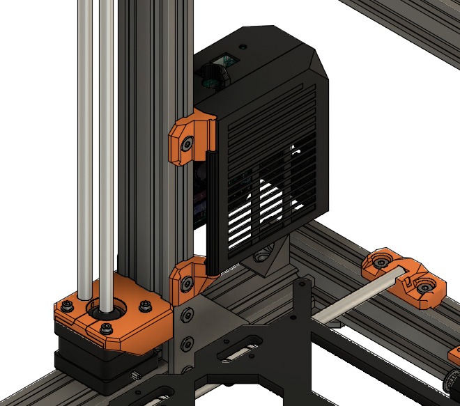

# Prusa i3 Full Upgrade MK2(s)

## Assembly Instructions

### Step 17

#### Parts  

* 6x cable_clip_lcd
* 5x cable_clip_round
* 3x cable_clip_ziptie
* Zip ties

#### Assembly

1. Follow the chapter ["8. Electronic Assembly" from original Prusa MK2s manual](http://manual.prusa3d.com/Guide/8.+Electronics+assembly/279?lang=en) to finish wiring all cables
1. Guide LCD cables using 6 cable_clip_lcd as seen on figure 17.1
1. Use other cable clips to guide other cables as highlighted in figure 17.2 to 17.5

\
*fig 17.1*

\
*fig 17.2*

\
*fig 17.3*

\
*fig 17.4*

\
*fig 17.5*

#### [Previous Step](step17.md) &nbsp;&nbsp;&nbsp; [Next Step](step18.md)
