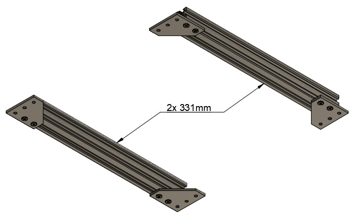
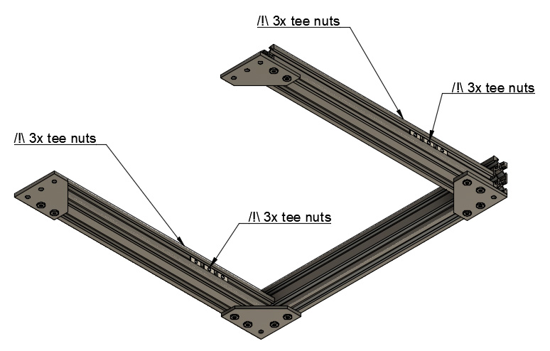

# Prusa i3 Full Upgrade MK3

## Assembly Instructions

### Step 1

#### Parts

* 2x 331mm V-Slots
* 1x 370mm V-Slots
* 4x 90° joining plates
* 12x M5x8mm screws
* 24x Tee nuts

#### Assembly

1. If you did not get your 90° joining plates from RatRig, file sharp edges on the diagonal of 90° joining plates (figure 1.1). A small chamfer is enough, this just to avoid scratching cables and it will be useful for the next step as well
1. Assemble 90° joining plates to the two 331mm v-slots as seen on figure 1.2 (with 8x M5x8mm screws and 8x tee nuts). Do not tighten M5 screws yet
1. Add 1x 370mm v-slot vertically as seen on figure 1.3 (with 4x M5x8mm screws and 4x tee nuts). Do not tighten M5 screws yet
1. Add 3 tee nuts on opposing sides of each of the 331mm v-slots (12x tee nuts in total) as seen on figure 1.4. The tee nuts go in the slots perpendicular to those to which the joining plates are attached. We will use these tee nuts later to attach the joining plates that hold the z-axis v-slots.

\
*fig 1.1*

\
*fig 1.2*

\
*fig 1.3*

\
*fig 1.4*

#### [Next Step](step02.md)
