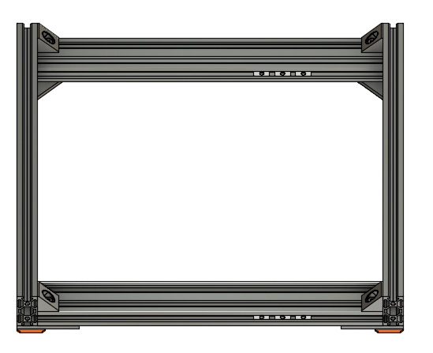

# Prusa i3 Full Upgrade MK3

## Assembly Instructions

### Step 4

#### Parts  

* 4x Black angle corners
* 8x M5x8mm screws
* 4x Tee nuts

#### Assembly

1. Screw 4x black angle corners on each corner as seen on figure 4.1 (with 4x tee nuts)
1. Check the frame is not twisted by pressing down each corner (on the v-slots)
1. If it is twisted, place an object (in red on figure 4.2) under one corner and apply pressure simultaneously to both perpendicular corners (A and B). Repeat this for left and right side until you get a perfectly flat frame 
   :warning: this step is very important, double check everything the frame is very flat and everything is still square
1. Strongly tighten frame screws and check others screws as well

\
*fig 4.1*

\
*fig 4.2*

#### [Previous Step](step03.md) &nbsp;&nbsp;&nbsp; [Next Step](step05.md)
