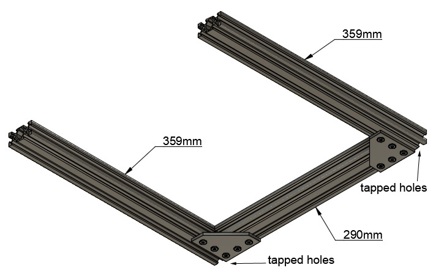
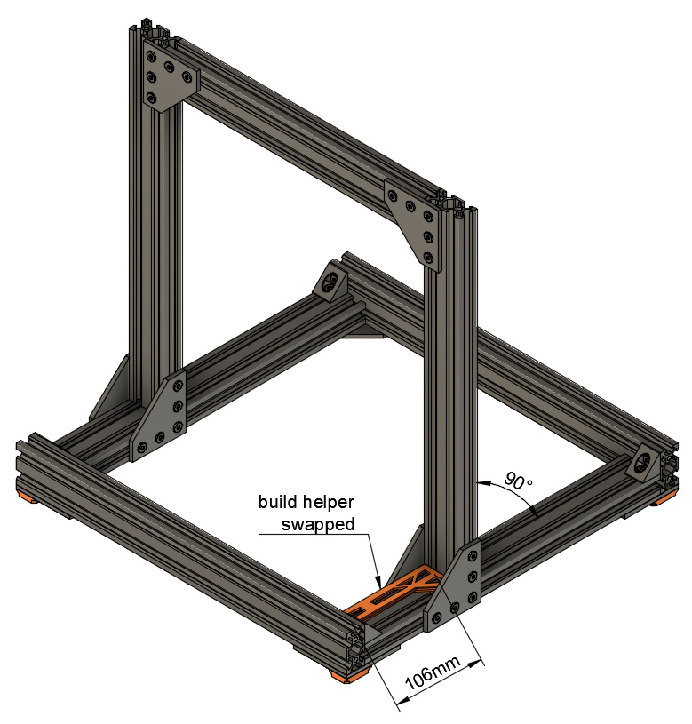
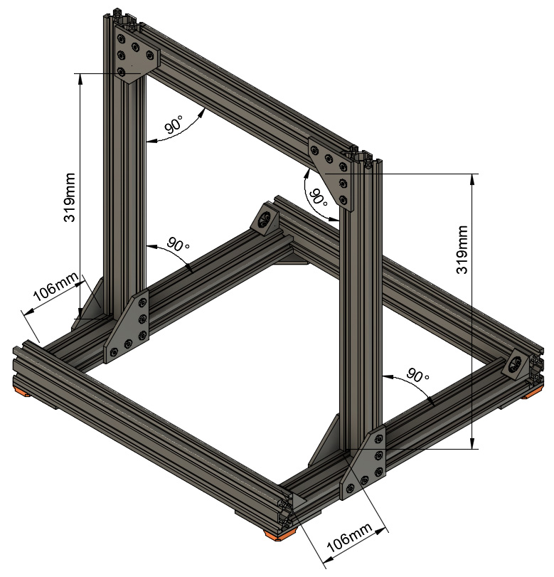

# Prusa i3 Full Upgrade MK3

## Assembly Instructions

### Step 6

#### Parts  

* 1x 290mm v-slot
* 2x 359mm v-slots
* 6x 90° joining plates
* 18x M5x8mm screws
* 18x Tee nuts

#### Assembly

1. If you did not get your 90° joining plates from RatRig, file sharp edges on the diagonal of 2x 90° joining plates (figure 6.1). A small chamfer is enough, this just to avoid scratching cables
1. Assemble 2x 359mm v-slots with one 290mm v-slot as seen on figure 6.2 with 2x 90° joining plates, 10x M5x8 screws and 10x tee nuts
1. Check all dimensions as seen on figure 6.3 
   :warning: this step is very important, double check everything is perfectly square
1. File **all** sharp edges of 4x latest 90° joining plates (not only diagonals) (figure 6.1). A small chamfer is enough, this just to avoid scratching cables and it will be useful for the next step as well
1. Assemble the 4x latest 90° joining plates as seen on figure 6.4

\
*fig 6.1*

\
*fig 6.2*

\
*fig 6.3*

\
*fig 6.4*

#### [Previous Step](step05.md) &nbsp;&nbsp;&nbsp; [Next Step](step07.md)
