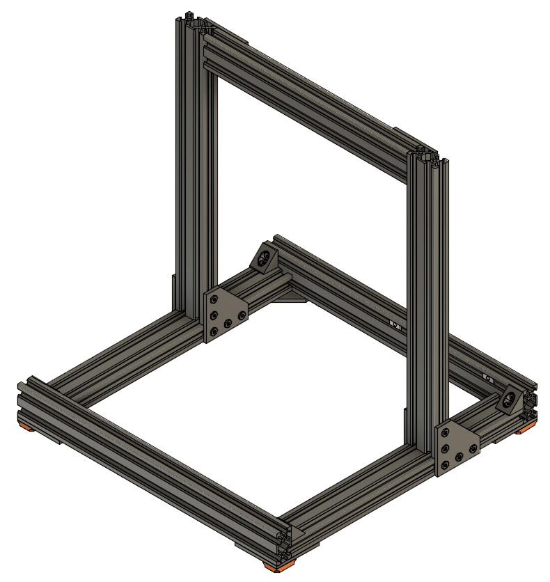
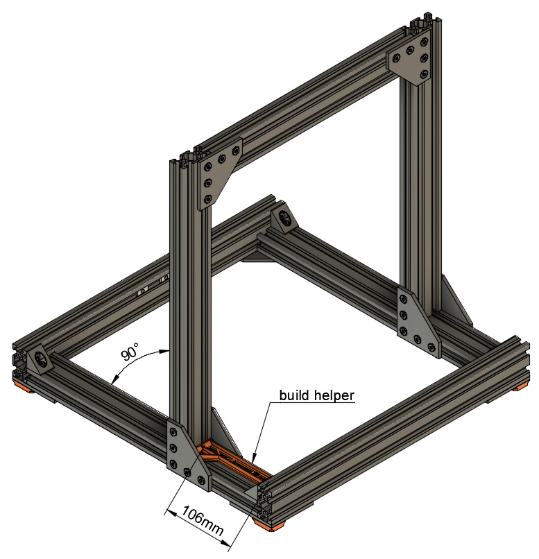
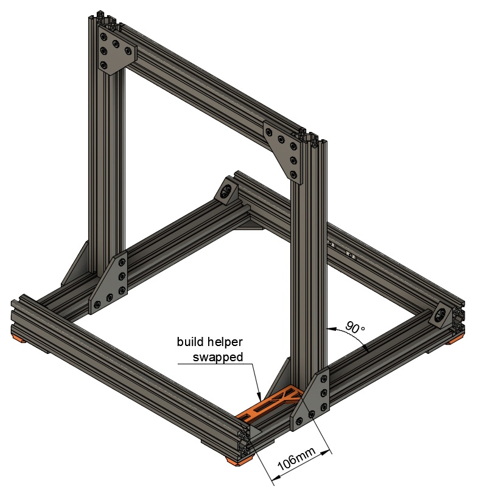

# Prusa i3 Full Upgrade MK3

## Assembly Instructions

### Step 7

#### Parts  

* 1x build_helper_106mm
* 1x Frame bottom
* 1x Frame Z axis
* 12x M5x8mm screws

#### Assembly

1. Double check the length of your build helper correspond to 106mm exactly
1. Assemble both parts of the frame together as seen on figure 7.1. Do not tighten M5 screws yet, it will be done in the two next steps
1. Adjust the 106mm distance on the left side using the build_helper_106mm as seen on picture 7.2. Ensure the Z axis is perfectly square. Strongly tight the M5 screws 
   :warning: this step is very important, double check everything is perfectly square
1. Adjust the 106mm distance on the right side using the build_helper_106mm (swap it) as seen on picture 7.3. Ensure the Z axis is perfectly square. Strongly tight the M5 screws 
   :warning: this step is very important, double check everything is perfectly square
1. :warning: Take the time to double check these points (figure 7.4) :
    * Everything is perfectly aligned and squared
    * 106mm is perfect on both sides
    * 290mm v-slot is square and has same height on each side of the Z axis
    * All screws have been strongly tightened

\
*fig 7.1*

\
*fig 7.2*

\
*fig 7.3*

\
*fig 7.4*

#### [Previous Step](step06.md) &nbsp;&nbsp;&nbsp; [Next Step](step08.md)
