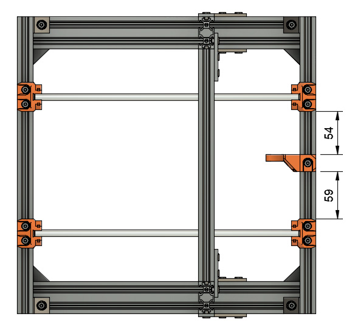
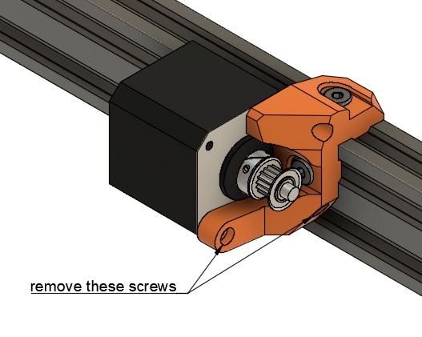

# Prusa i3 Full Upgrade MK3

## Assembly Instructions

### Step 9

#### Parts  

* 1x y_idler
* 1x psu_lower_mount
* 1x y_motor_mount
* 1x Y motor
* 3x M3x10 screws (2x from original Y motor mount, 1 from original Z motor mount)
* 3x M5x10mm screws
* 2x M5x12mm screws

#### Assembly

1. Screw the y_motor_mount on the back of the frame using 2x M5x12 and adjust to the dimensions in figure 9.1
1. Assemble the Y motor on the y_motor_mount with 3x M3x10 screws (figure 9.2). Ensure the correct orientation of motor cables
1. Screw the y_idler using 2x M5x10 and adjust to the dimensions in figure 9.3.
1. Ensure the correction orientation of y_idler, the nut should be on the same side as the single Y axis bearing
1. Screw the psu_lower_mount to the top half of the extrusion using 1x M5x10 and adjust to the dimensions in figure 9.4

\
*fig 9.1*

\
*fig 9.2*

\
*fig 9.3*

\
*fig 9.4*

#### [Previous Step](step08.md) &nbsp;&nbsp;&nbsp; [Next Step](step10.md)
