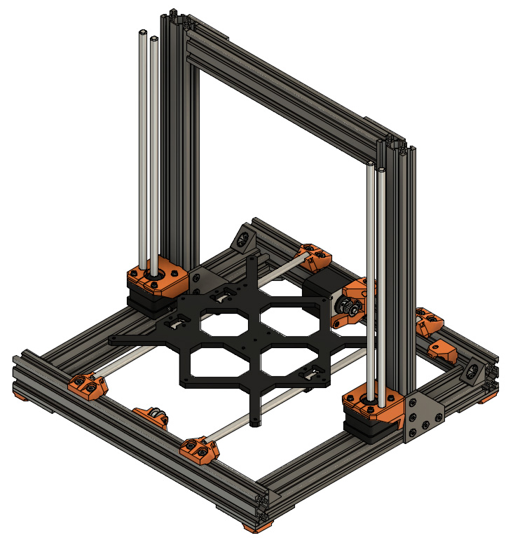

# Prusa i3 Full Upgrade MK3

## Assembly Instructions

### Step 11

#### Parts  

* 2x z_motor_mounts
* 6x M5x10mm screws
* 6x Tee nuts

#### Assembly

1. Assemble 3x M5x10 screws with 3x tee nuts on each z_motor_mount
1. Slide from top the z_motor_mounts on the Z axis (figure 11.1). Ensure the smooth rods holes are facing outside
1. Ensure z_motor_mounts are touching the bottom horizontal v-slot and they are at 90° compared to vertical v-slot (figure 11.2)
1. Tighten strongly all M5x10 screws

\
*fig 11.1*

\
*fig 11.2*

#### [Previous Step](step10.md) &nbsp;&nbsp;&nbsp; [Next Step](step12.md)
