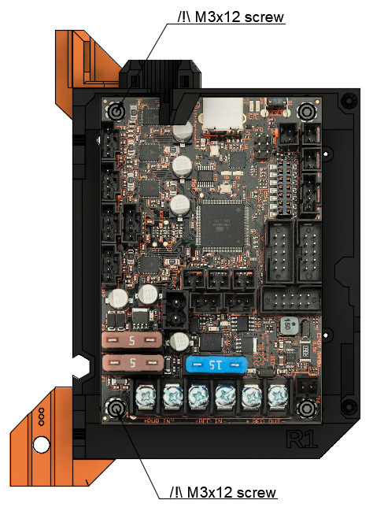

# Prusa i3 Full Upgrade MK3

## Assembly Instructions

### Step 15

#### Parts  

* 2x psu_upper_mount
* 2x M4x12 screws (original ones used to assemble the PSU to the frame)
* 3x M5x10 screws
* 2x Tee nuts
* 1x M3 washer (from the original PSU lower mount)
* 1x M3 screw (from the original PSU lower mount)
* 1x M3 nut (from the original PSU lower mount)

#### Assembly

1. Insert 1x M4x12mm screw in each psu_upper_mount as seen in figure 15.1. If you have trouble getting the M4 screw in the hole, insert your finger in the big polygonal vertical hole
1. Screw each psu_upper_mount to the PSU
1. Screw PSU to the back of the frame as seen in picture 15.2 with 2x M5x10mm and 2x tee nuts
1. Add M3 nut into the psu_lower_mount (figure 15.3)
1. Screw the PSU to the psu_lower_mount with the M3 washer and the M3 screw
1. Screw last M5x10 from psu_lower_mount to the frame. 

\
*fig 15.1*

\
*fig 15.2*

\
*fig 15.3*

#### [Previous Step](step14.md) &nbsp;&nbsp;&nbsp; [Next Step](step16.md)
