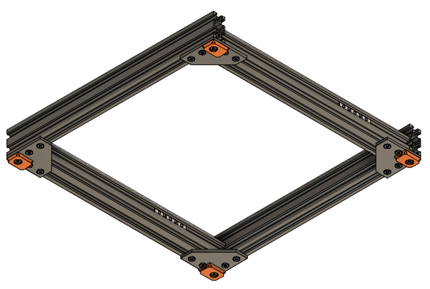
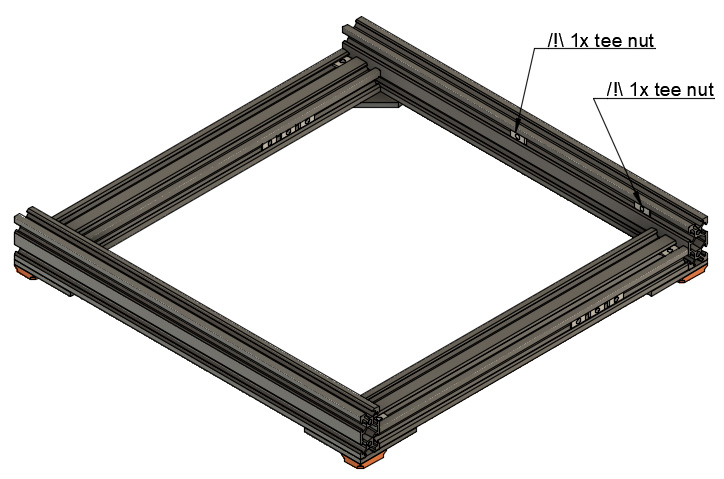
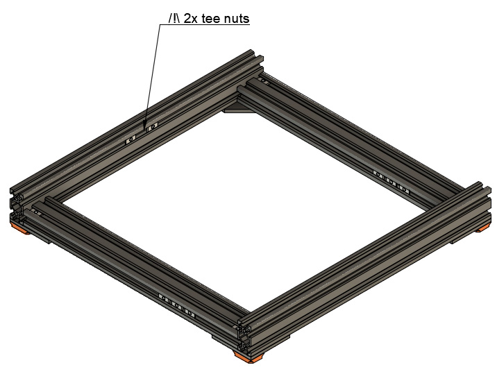

# Prusa i3 Full Upgrade MK3

## Assembly Instructions

### Step 3

#### Parts  

* 4x Feet
* 4x M5x12mm screws
* 8x Tee nuts

#### Assembly

1. Screw 4x feet with 4x M5x12 and 4x tee nuts as seen on figure 3.1
1. Add 2x tee nuts for y_motor_mount and psu_lower_mount as seen on figure 3.2
1. Add 2x tee nuts for y_idler as seen on figure 3.3

\
*fig 3.1*

\
*fig 3.2*

\
*fig 3.3*

#### [Previous Step](step02.md) &nbsp;&nbsp;&nbsp; [Next Step](step04.md)
