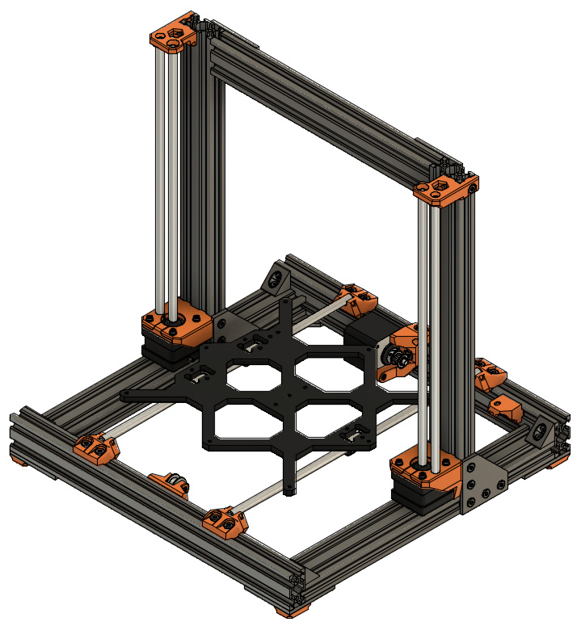

# Prusa i3 Full Upgrade MK3

## Assembly Instructions

### Step 13

#### Parts  

* 2x z_tops
* 4x M5x10 screws
* 4x Tee nuts

#### Assembly

1. Assemble 2x M5x10 screws with 2x tee nuts on each z_top
1. Slide from top the z_tops and insert the Z smooth rods in the appropriate hole (figure 13.1)
1. Push strongly the z_tops in order to have the Z smooth rods touching the top of the rod hole (figure 13.2)
1. Ensure that top of z_tops are perpendicular to vertical v-slots
1. Tighten strongly all M5x10 screws

\
*fig 13.1*

\
*fig 13.2*

#### [Previous Step](step12.md) &nbsp;&nbsp;&nbsp; [Next Step](step14.md)
