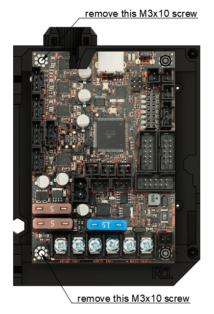
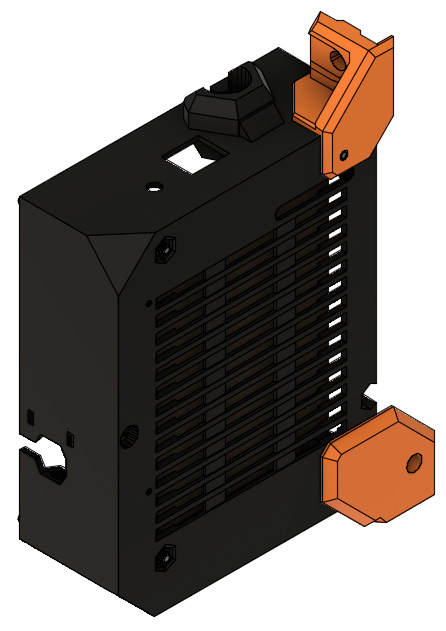

# Prusa i3 Full Upgrade MK3

## Assembly Instructions

### Step 16

#### Parts  

* 1x rambo_base_lower_mount
* 1x rambo_base_upper_mount
* 2x M3x12 screws
* 1x RAMBo cover with Einsy RAMBo PCB mounted inside
* 2x M5x8 screws
* 2x Tee nuts

#### Assembly

:heavy_exclamation_mark: X axis cables are not visible in these figures and will not be visible in the following ones

1. Remove the 2x M3x10 screws from the left of the Einsy RAMBo PCB as highlighted in figure 16.1. Remove corresponding M3 nuts on back as well
1. Insert rambo_base_upper_mount on top and rambo_base_lower_mount on bottom of the cover as seen in figure 16.2
1. Screw carefully 2x M3x12 in holes as highlighted in figure 16.3 
   :warning: do not reuse M3x10 screws previously removed
1. Pass the X motor cable in the appropriate hole (figure 16.4) and fix the RAMBo cover to the frame using 2x M5x8 screws et 2x tee nuts
1. Ensure that the bottom of the rambo_base_lower_mount is touching the top of 90° joining plate

\
*fig 16.1*

\
*fig 16.2*

\
*fig 16.3*

\
*fig 16.4*

#### [Previous Step](step15.md) &nbsp;&nbsp;&nbsp; [Next Step](step17.md)
