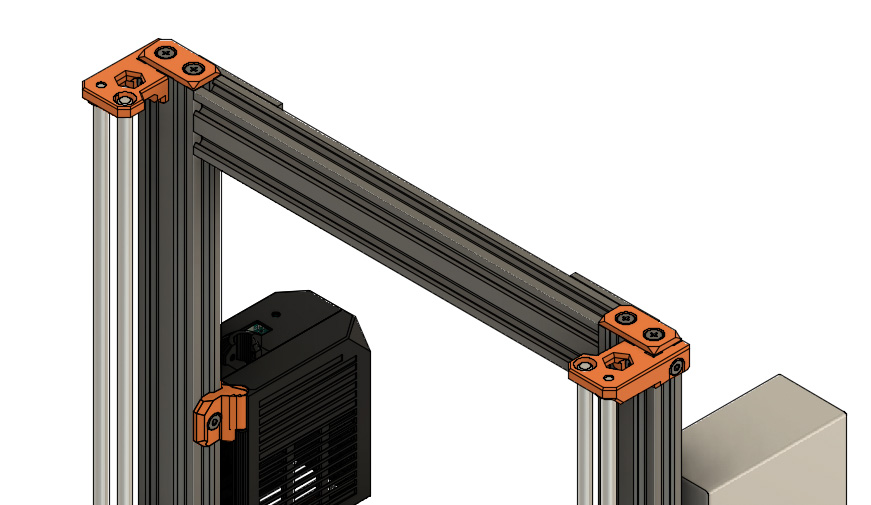

# Prusa i3 Full Upgrade MK3

## Assembly Instructions

### Step 19

#### Parts  

* 2x end_cap_z_axis
* 4x M5x8 screws (for official kit) or 4x self tapping screws M5 (for DIY)

#### Assembly

:heavy_exclamation_mark: If you are using a kit from our official distributors use M5x8 screw, otherwise use self tapping screws. Check [step 5](step05.md) for more details.

1. Assemble 2x end_cap_z_axis on top of Z axis as seen in figure 19.1 

\
*fig 19.1*

#### [Previous Step](step18.md) &nbsp;&nbsp;&nbsp; [Next Step](step20.md)
