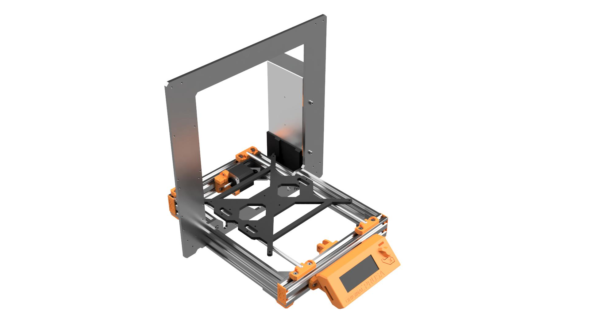
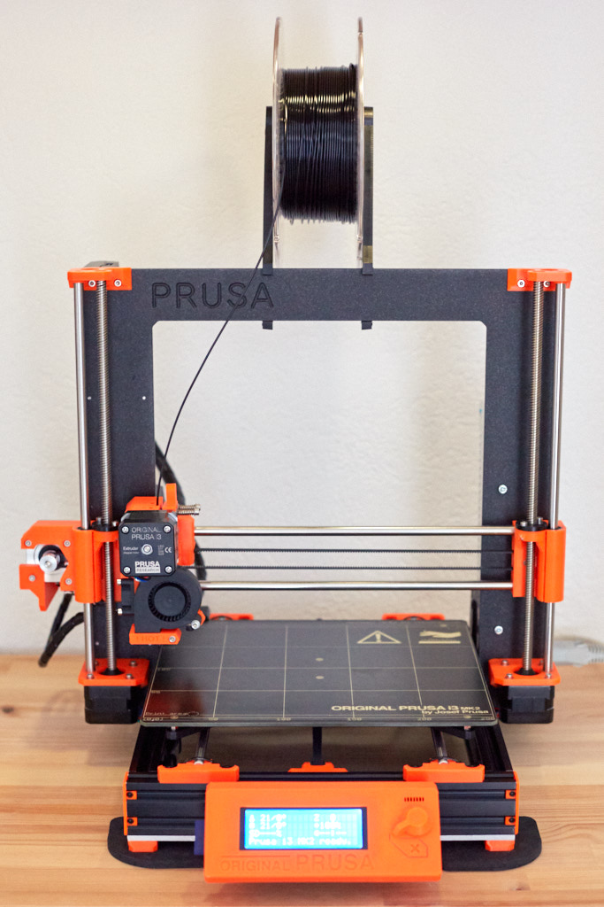
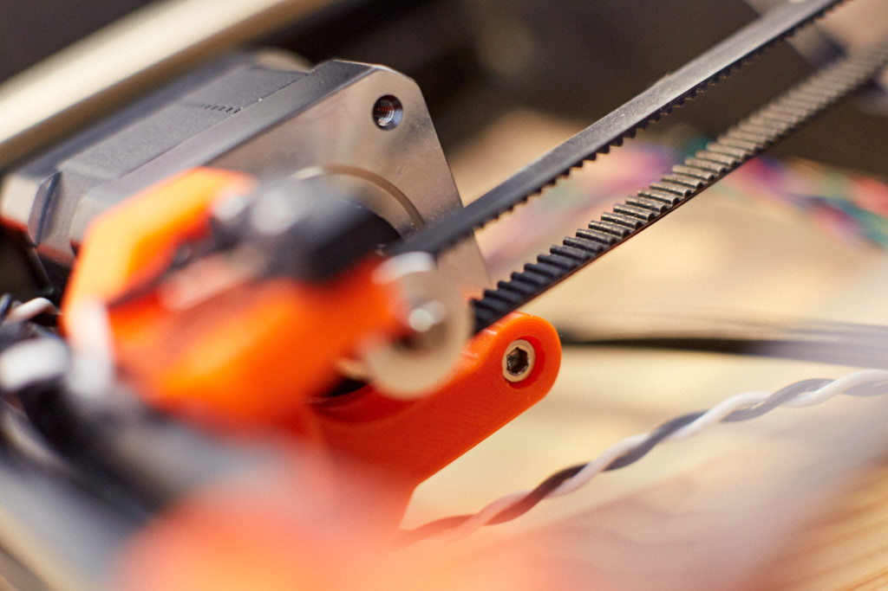
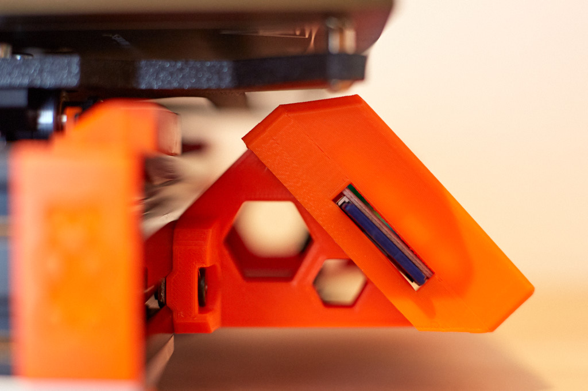
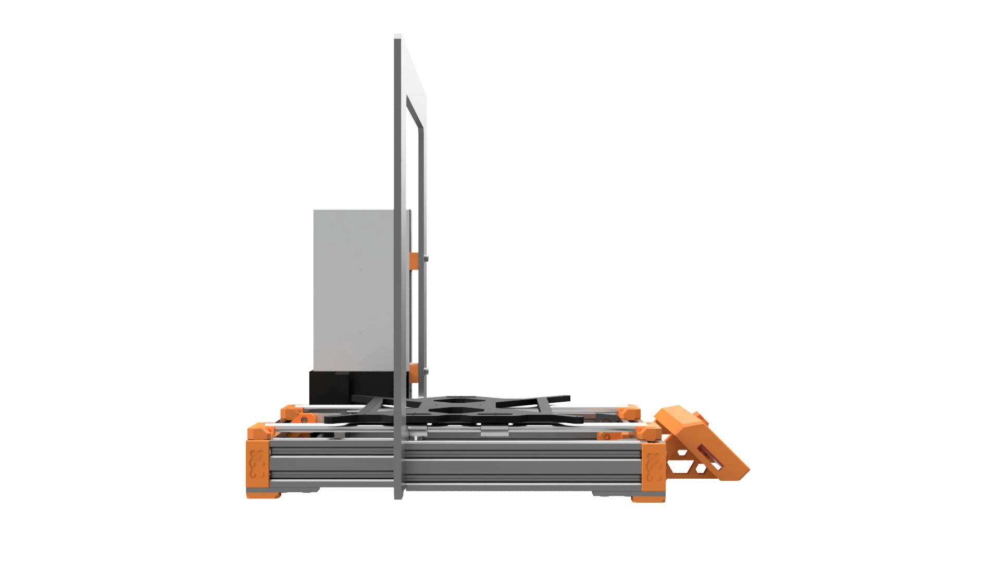
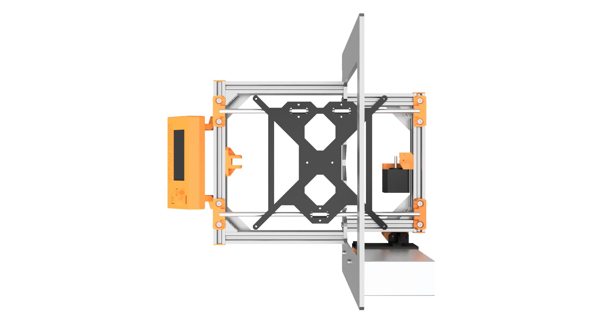
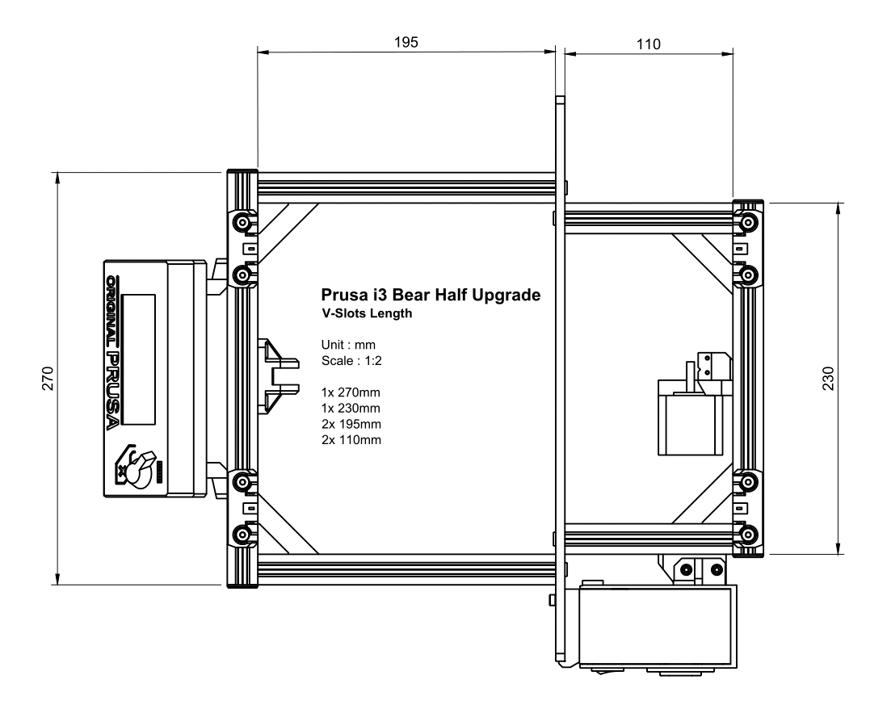
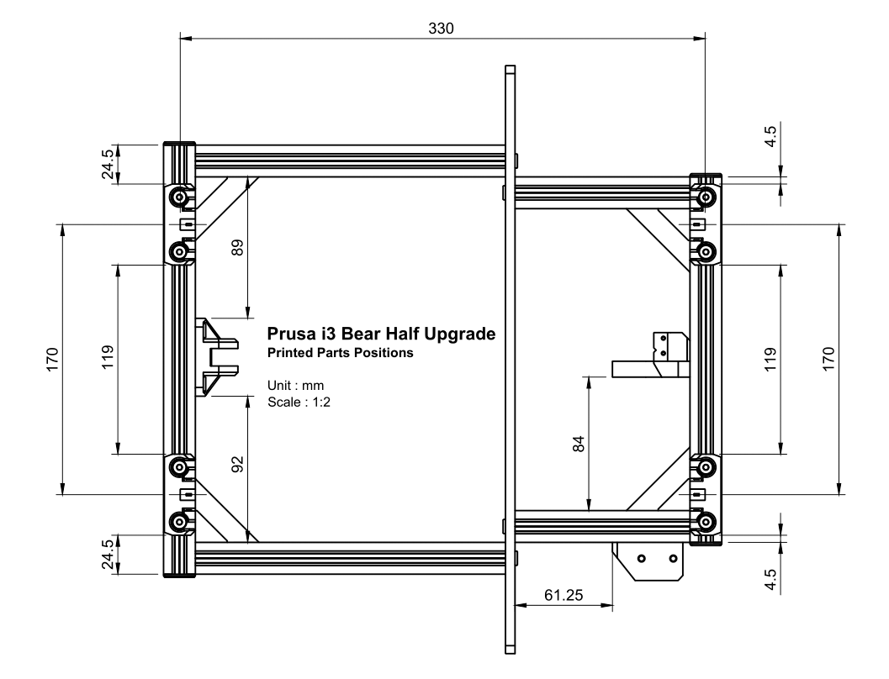
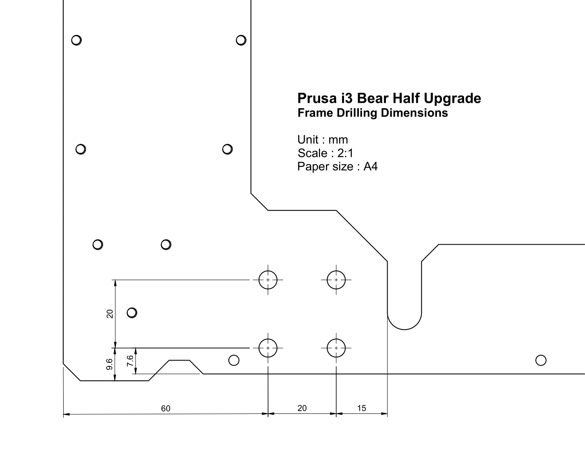

# Prusa i3 Bear Half Upgrade

This is the HALF version of the Prusa i3 Bear upgrade. An affordable upgrade to get a much stronger frame for your MK2, MK2s or MK2.5. If you would like to have an even stronger frame check out the [full upgrade version](/full_upgrade/) or spot the differences on the [home page](https://github.com/gregsaun/prusa_i3_bear_upgrade/).

## Features

* Stronger and quieter
* Easier to maintain and customise
* Use as much as possible original parts (no need to print a new RAMBo cover nor change any cable, rods or firmware)
* Compatible with MK2, MK2s and MK2.5
* Highly detailed manual
* Use more aluminum and less printed parts (3D printed parts can crack and are less reliable)
* Use Openbuilds hardware :
  * Single platform of multitude compatible hardware parts
  * V-Slot offer more possibilities to printed parts and customisation than T-Slot
  * Open source with powerful community
  * Easy to square and build
  * Worldwide shipping plus several other shops selling these parts
* Other type of aluminum extrusions can be supported thanks to parametric design (check Fusion 360 files)
* 3D printed parts designed using advanced techniques like selective infill, clean vertical holes, sharp angle...
* Open source by providing STL, STEP and Autodesk Fusion 360 files

## What's new in v2.0 ?

* Use smaller screws on Y motor mount to easily remove all motor screws when tightened to the frame
* Improved manual
* Stronger rod holders (and use less plastics)
* PSU lower mount uses pockets for nuts to ease assembly
* Feet are thinner
* Nicer LCD supports
* Minor improvements for better printing quality and durability

## Manual

The manual contains bill of material (bom), preparing frame and v-slots, print settings and assembly instructions.

[Read it here](manual/)

## Modify the original aluminum frame

With this upgrade you will need to drill the original frame of your Prusa i3 MK2, MK2s or MK2.5.

I have made a [3D printed part](printed_parts/stl/drilling_helpers.stl) to help you place the holes accurately. You can double check the positions with [this PDF](doc/frame_drilling_dimensions.pdf).

As you will see in the bill of material, the recommended drill bit is a 5.3mm.

If you break the frame, you can send an email to Prusa support to get a new one. You will find few in the Chinese market as well.

If you have access to a CNC machine, you can use [this DXF here](doc/alu_frame/).

## Purchase Openbuilds V-Slots

Here is a list of [Openbuilds stores](/doc/openbuilds_stores_list.md). Note that few stores are selling a pre-cut V-Slots.

## Images

