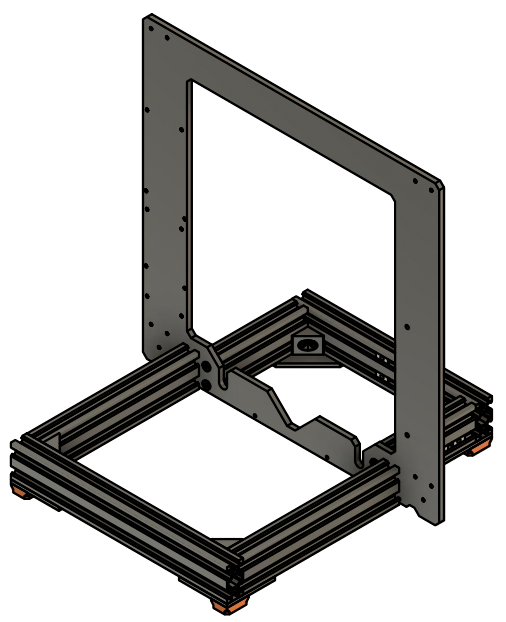

# Prusa i3 Half Upgrade

## Assembly Instructions

### Step 5

#### Parts

* 1x Original aluminum frame
* 2x Tee nuts
* 4x M5x15mm screws

#### Assembly

1.  Add 2 tee nuts as seen on figure 5.1
1.  Assemble everything together with 4 M5x15 screws (fig 5.2)
1.  Adjust back v-slots (that are tight to the frame) to be at the same level as the front assembly

\
*fig 5.1*

\
*fig 5.2*

#### [Previous Step](step04.md) &nbsp;&nbsp;&nbsp; [Next Step](step06.md)