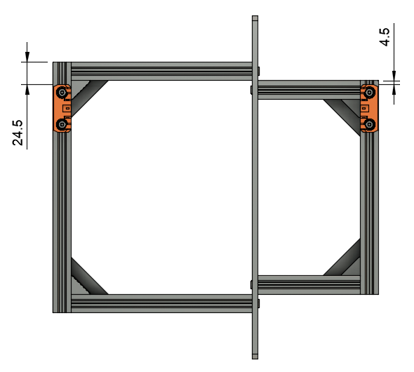
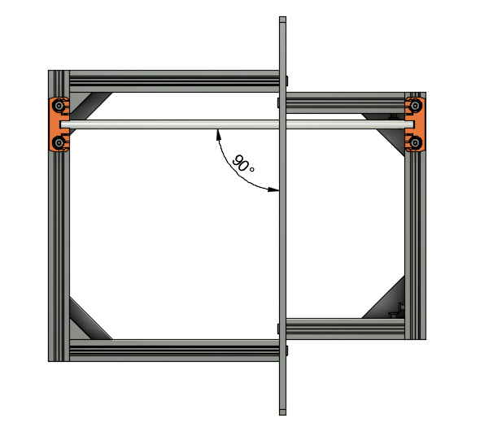
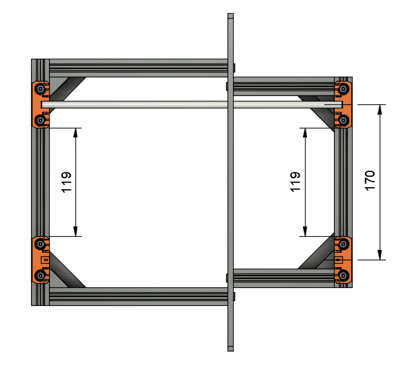

# Prusa i3 Half Upgrade

## Assembly Instructions

### Step 7

#### Parts

* 4x Rod holders
* 8x M5x10mm screws
* 8x Tee nuts
* 8x Zip ties
* 2x 330mm smooth rods
* 1x Print bed

#### Assembly

1. Assemble 2 rod holders on the right side of the frame (fig 7.1) with 4 M5x10 and 4 tee nuts
1. Adjust to the match measurements on fig 7.1
1. Add the rod on this two holders
1. Check they are perpendicular to the frame with a square (fig 7.2)
1. Assemble 2 other rod holders on the left side of the frame (fig 7.3) with 4 M5x10 and 4 tee nuts
1. Remove the first rod and assemble the two rods on the print bed
1. Fix print bed and rods to the rod holders (fig 7.4)
1. Adjust to match the measurements on bottom picture (fig 7.4). Take your time to have perfect measurements or the calibration might fail
1. Add zip ties to all rod holders

\
*fig 7.1*

\
*fig 7.2*

\
*fig 7.3*

#### [Previous Step](step06.md) &nbsp;&nbsp;&nbsp; [Next Step](step08.md)