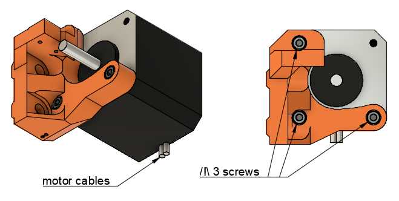
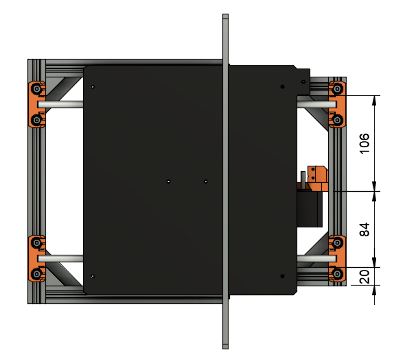
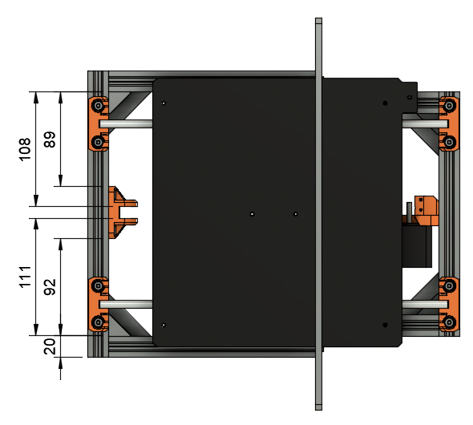

# Prusa i3 Half Upgrade

## Assembly Instructions

### Step 8

#### Parts

* 1x y_motor_mount
* 1x y_idler
* 2x M5x15mm screws
* 2x M5x10mm screws
* 1x Y motor with its original M3x10 screws
* 1x M3x10 screws (get it from Prusa spare parts bag)

#### Assembly

1. Assemble the Y motor on the y_motor_mount with 3 M3x10 screws. Ensure the correct orientation of motor cables as in fig 8.1
1. Mount the motor on the back of the frame using 2 M5x15 and adjust to the measurements on figure 8.2
1. The motor cables should face the 230mm v-slots
1. Mount y_idler using 2 M5x10 and adjust to the measurements on figure 8.3

\
*fig 8.1*

\
*fig 8.2*

\
*fig 8.3*

#### [Previous Step](step07.md) &nbsp;&nbsp;&nbsp; [Next Step](step09.md)