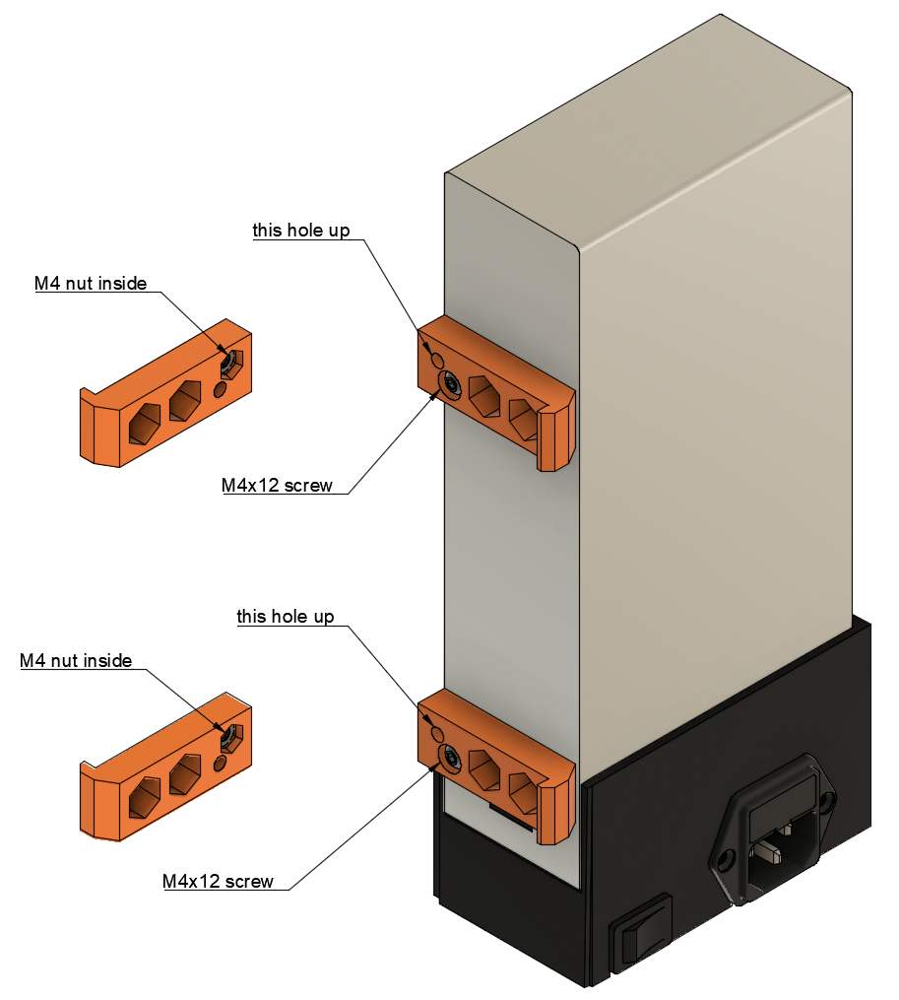

# Prusa i3 Half Upgrade

## Assembly Instructions

### Step 10

#### Parts

* 2x psu_upper_mounts
* 2x M4x12 screws (the one used to assemble the PSU to the frame
* 2x M4 nuts
* 1x psu

#### Assembly

1. Add nuts in the hex hole of each psu_upper mount
1. Bolt the psu_upper_mounts to the PSU using M4x12 screws. The hole with the nut should face up and against the PSU

\
*fig 10.1*

#### [Previous Step](step09.md) &nbsp;&nbsp;&nbsp; [Next Step](step11.md)