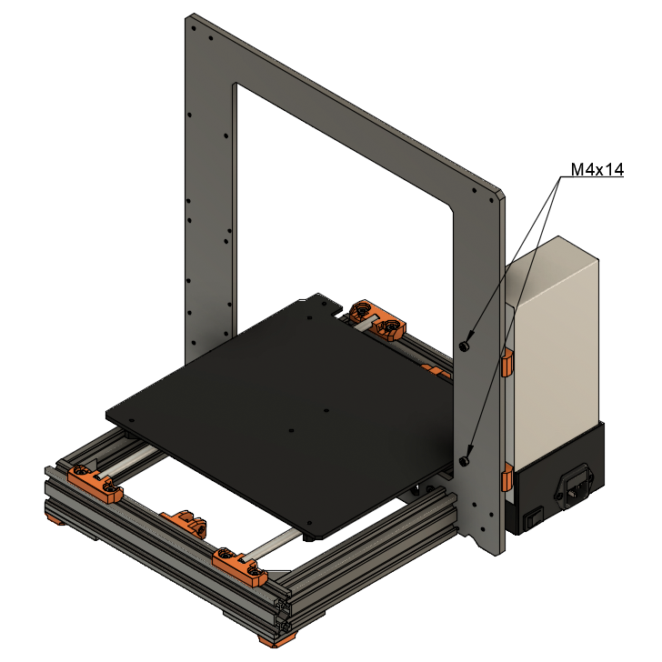

# Prusa i3 Half Upgrade

## Assembly Instructions

### Step 11

#### Parts

* 2x M4x14 screws

#### Assembly

1. Assemble PSU to the frame with M4x14 screws

\
*fig 11.1*

#### [Previous Step](step10.md) &nbsp;&nbsp;&nbsp; [Next Step](step12.md)