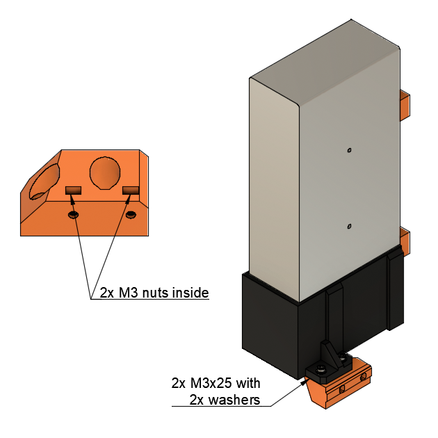
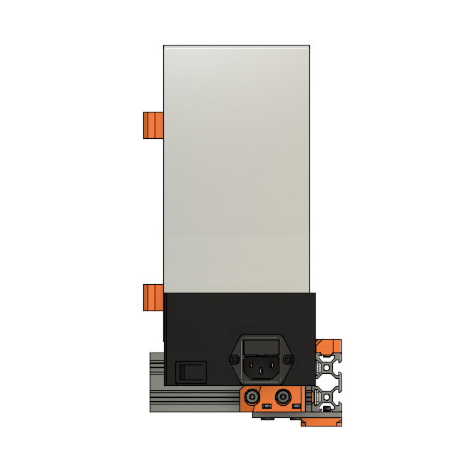

# Prusa i3 Half Upgrade

## Assembly Instructions

### Step 12

#### Parts

* 1x psu_lower_mount
* 2x M3x25 screws (from the original psu mount)
* 2x M3 washers (from the original psu mount)
* 2x M3 nuts (from the original psu mount)
* 2x M5x10

#### Assembly

1. Insert 2 M3 nuts inside small holes of psu_lower_mount as in figue 12.1
1. Assemble psu_lower_mount on the PSU with 2 M3x25 and 2 M3 washers. Do not tight them too much, the psu_lower_mount should move freely (will be tight after) (fig 12.1)
1. Bolt 2 M5x10 to the tee nuts, tight strongly to the frame (fig 12.2)
1. Finish to tight the all screws (fig 12.2)

\
*fig 12.1*

\
*fig 12.2*

#### [Previous Step](step11.md) &nbsp;&nbsp;&nbsp; [Next Step](step13.md)