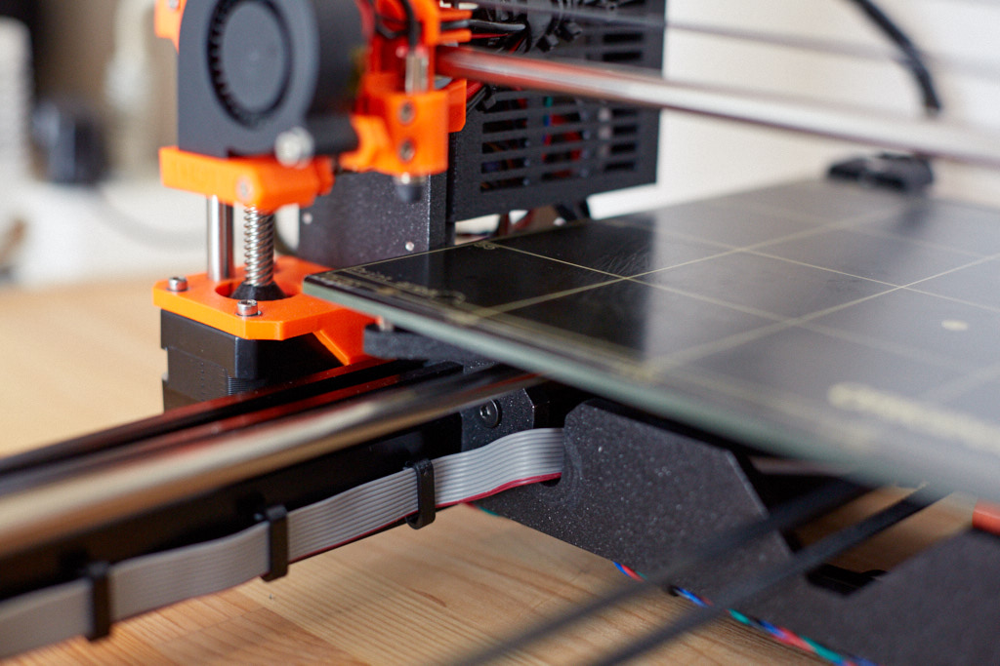

# Prusa i3 Half Upgrade

## Assembly Instructions

### Step 14

### Parts

* 7x cable_clip_lcd
* 4x cable_clip_ziptie

#### Assembly

1. Finish the build with all other Prusa original parts
1. Guide LCD cables using 7 cable_clip_lcd as on figure 14.1 and 14.2
1. Guide other cables on the back using 4 cable_clip_ziptie as on picture 14.3 and 14.4

\
*fig 14.1*

\
*fig 14.2*

\
*fig 14.3*

\
*fig 14.4*

#### [Previous Step](step13.md) &nbsp;&nbsp;&nbsp; [Next Step](step15.md)