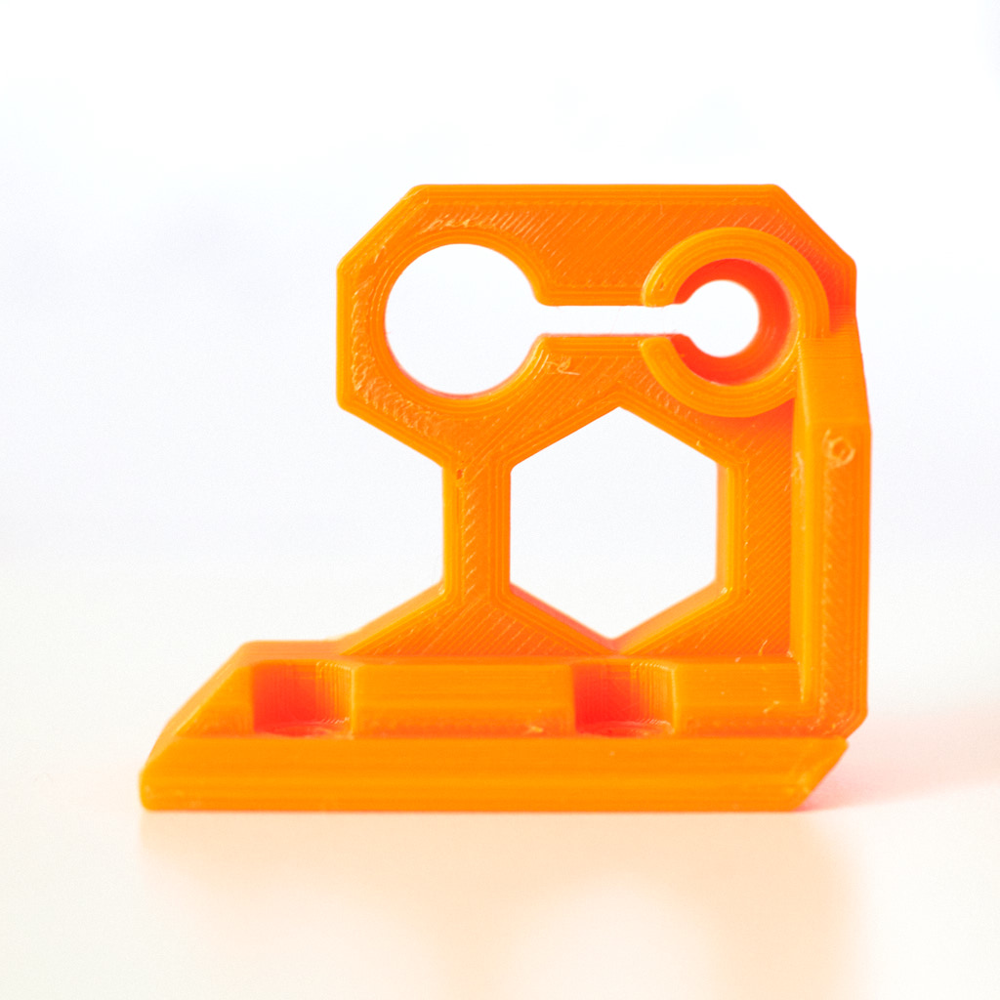
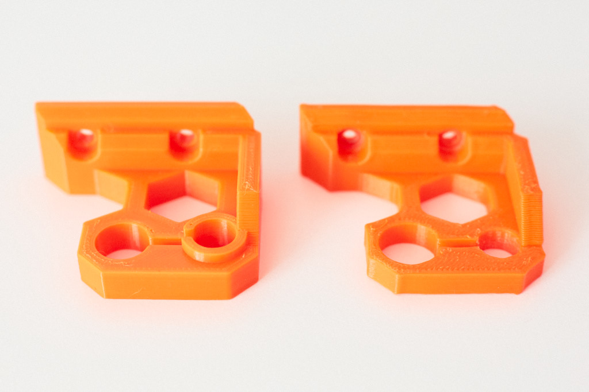
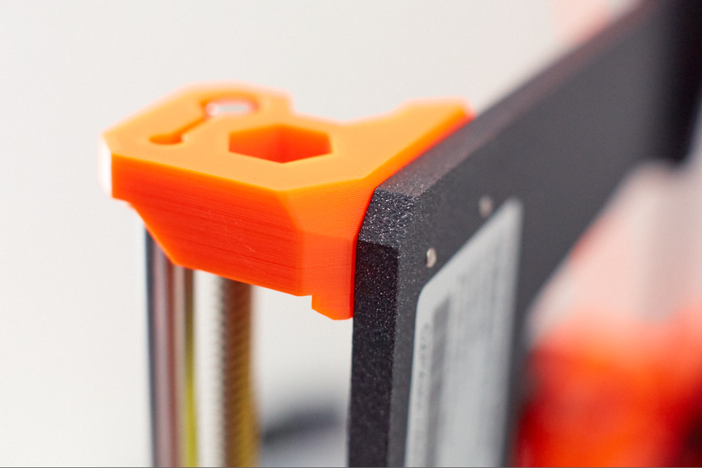

# Z Top Fix

There is an issue on original Z axis rod where the Z rod are neither parallel nor perpendicular ! More details here : https://github.com/prusa3d/Original-Prusa-i3/issues/34

This z axis top solve the problem plus it makes the bracket stronger and it increases the support of Z rod (should reduce Z wobble as well).

It is compatible with Prusa i3 MK2, MK2s and MK2.5.

Please note that you should have a space of 0.5mm between the top of the Z rod and the smaller circle, this is made on purpose. Do not push the rod to the "cap" of this piece but screw it and check that it is square to the frame.

## Images

## Updates :
* version 1.1 : increase threaded rod hole diameter
* version 1.2 : reduce hexagon hole and add little chamfer. this helps fitting accessories in this hole