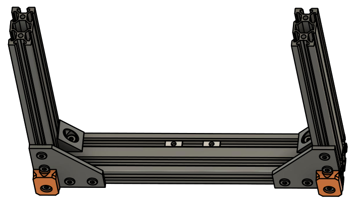

# Assembly Instructions

## Step 2

### Parts

* 2x feet
* 2x M5x15mm screws
* 2x Tee nuts

#### Assembly

1. Lay down the frame on a flat surface with 90° plates facing the sky
1. Push down on each corners to check the twist of the frame (fig 2.1). If it wobbles, slightly loosen the 90° plates screws (but not the black angle corner!) and twist the frame until it is flat (you can use an object under a corner to help twisting the frame)
1. Once the frame is flat, tighten strongly everything and add the feet using M5x15 and two tee nuts (fig 2.2)

\
*fig 2.1*

\
*fig 2.2*

[Previous Step](step01.png)   [Next Step](step03.png)