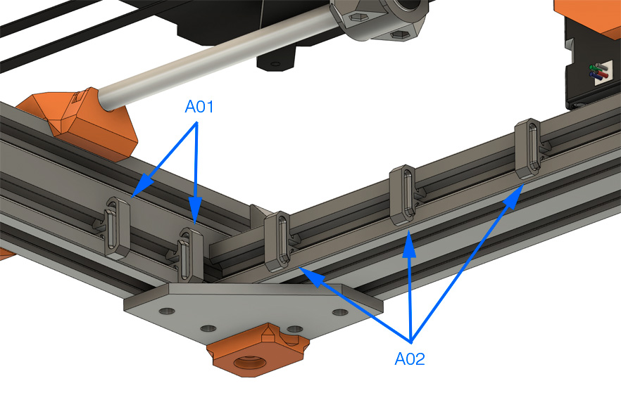
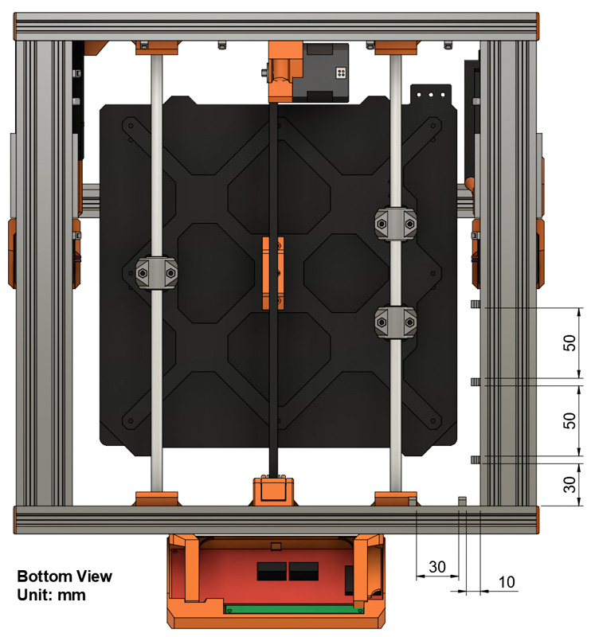
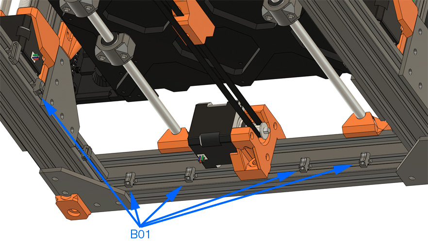
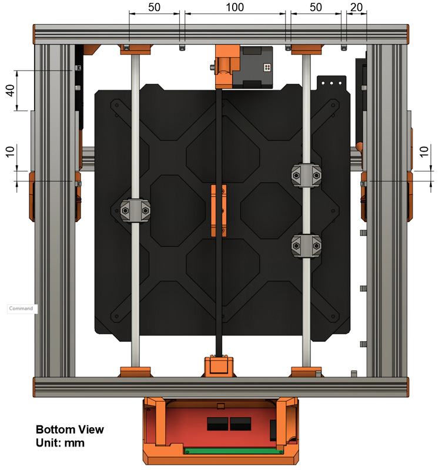
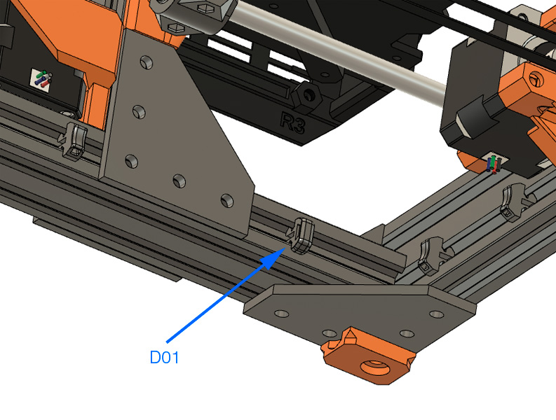
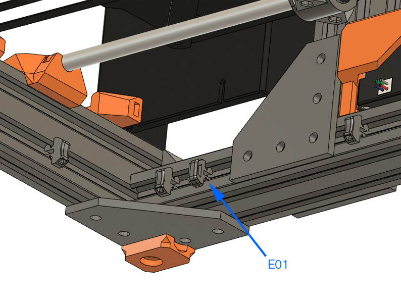

# Bear Upgrade 2.1

## Temporary assembly guide for new parts of Bear Upgrade 2.1

### Warning :warning:

Please refer to assembly guide for Bear Upgrade 2.0 for the complete assembly.

This is only covering temporarily the new features of Bear Upgrade 2.1.

:warning: Those instructions are for advanced users, if you are not sure how to proceed, please wait the final release.

### Z Axis

#### Parts that needs to be printed

  1. cable_clip_lcd
  1. cable_clip_vertical
  1. cable_clip_horizontal

#### Cable Clip LCD

  * **A01:** 2x cable_clip_lcd. Opening face up.
  * **A02:** 3x cable_clip_lcd. Opening face down.

Follow the positions according to the image below:

#### Cable Clip Vertical

  * **B01:** 5x cable_clip_vertical.

  * **C01:** 1x cable_clip_vertical.

Follow the positions according to the image below:

#### Cable Clip Horizontal

  * **D01:** 1x cable_clip_horizontal.

  * **E01:** 1x cable_clip_horizontal.

Follow the positions according to the image below:

#### Cable Management

1. Pass the LCD cables into the with LCD cable clips.
1. Pass zip ties in all vertical and horizontal cable clips. Reassemble all wires and fix them with the zip ties.
