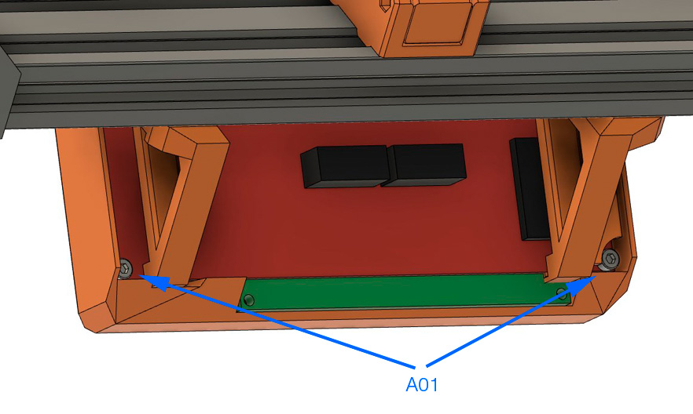
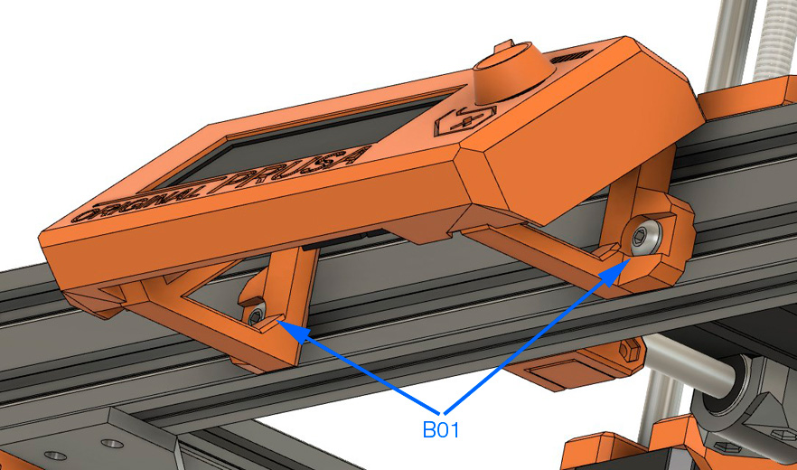

# Bear Upgrade 2.1

## Temporary assembly guide for new parts of Bear Upgrade 2.1

### Warning :warning:

Please refer to assembly guide for Bear Upgrade 2.0 for the complete assembly.

This is only covering temporarily the new features of Bear Upgrade 2.1.

:warning: Those instructions are for advanced users, if you are not sure how to proceed, please wait the final release.

### LCD Supports

  * **A01:** M3x10mm.

  * **B01:** M5x10mm.
