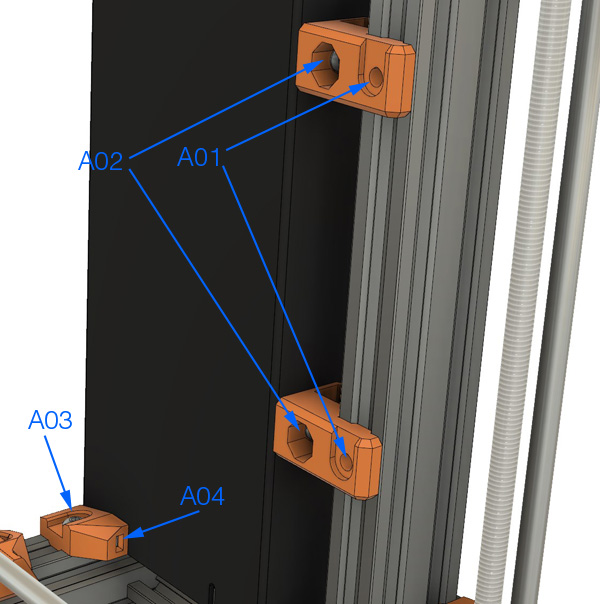
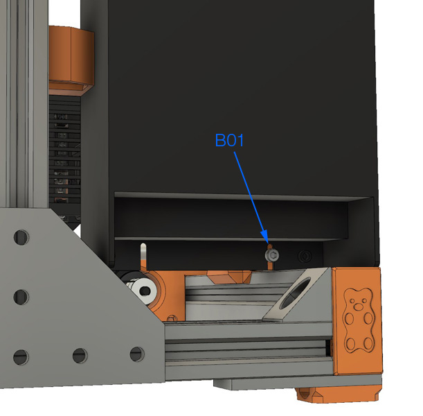
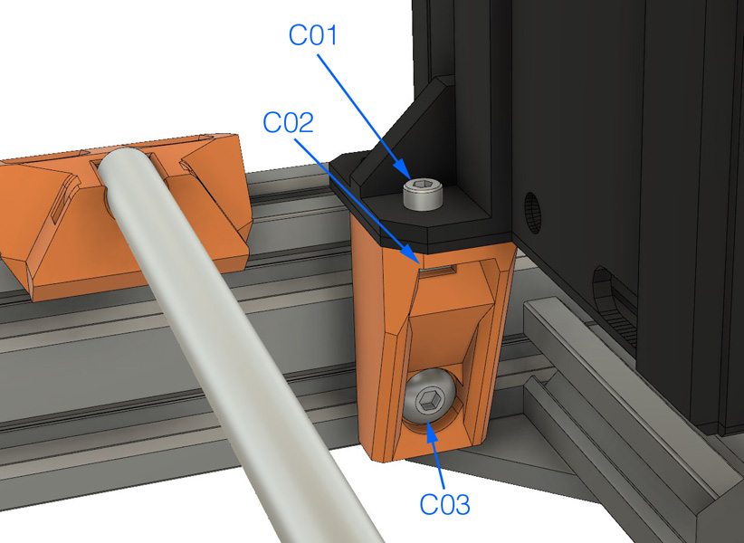
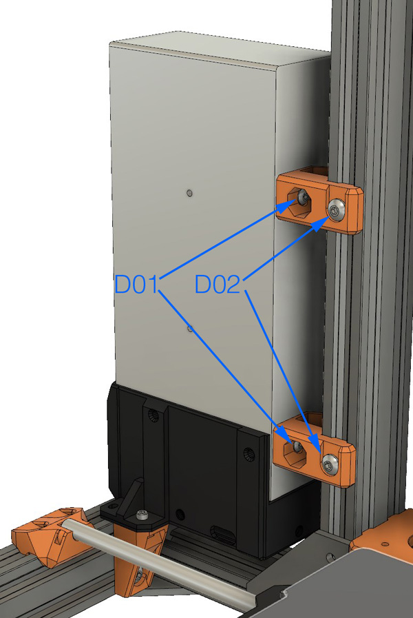

# Bear Upgrade 2.1

## Temporary assembly guide for new parts of Bear Upgrade 2.1

### Warning :warning:

Please refer to assembly guide for Bear Upgrade 2.0 for the complete assembly.

This is only covering temporarily the new features of Bear Upgrade 2.1.

:warning: Those instructions are for advanced users, if you are not sure how to proceed, please wait the final release.

### PSU

#### Parts that needs to be printed

  1. psu_lower_mount
  1. psu_upper_mount (for MK3(S) choose the silver or black according to your PSU)

#### MK3(S) Black PSU Assembly

* **A01:** M5x10mm
* **A02:** M4x10mm (from original PSU)
* **A03:** M5x10mm
* **A03:** Square nut

* **B01:** M3x10mm

#### MK2(S), MK2.5(S) and MK3(S) Silver PSU Assembly

* **C01:** M3 screw. The length depends on what Prusa delivers to you, they are all compatible
* **C02:** Square nut
* **C03:** M5x10mm

* **D01:** M4x10mm (from original PSU)
* **D02:** M5x10mm
