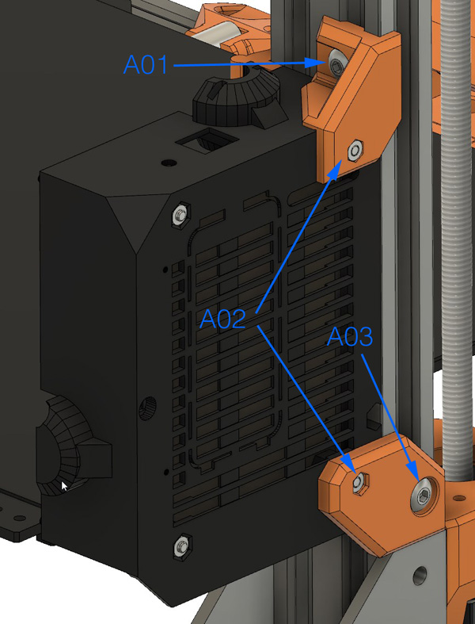
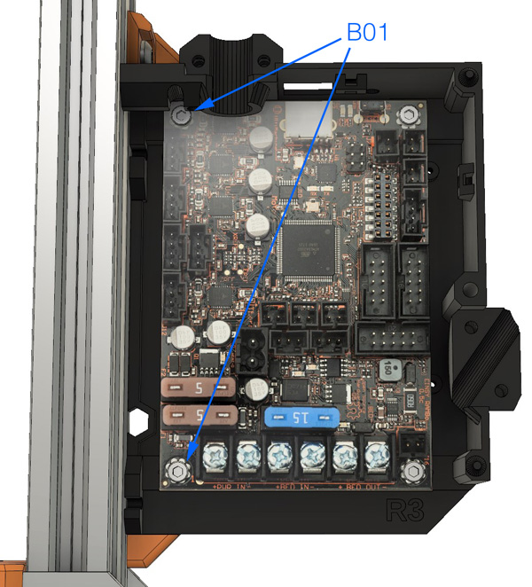

# Bear Upgrade 2.1

## Temporary assembly guide for new parts of Bear Upgrade 2.1

### Warning :warning:

Please refer to assembly guide for Bear Upgrade 2.0 for the complete assembly.

This is only covering temporarily the new features of Bear Upgrade 2.1.

:warning: Those instructions are for advanced users, if you are not sure how to proceed, please wait the final release.

### Rambo Mini/Einsy Base

#### Parts that needs to be printed

  1. rambo_base_upper_mount
  1. rambo_base_lower_mount

#### Assembly

* **A01:** M5x8mm
* **A02:** M3 hex nut
* **A03:** M5x8mm

* **B01:** M3x14mm
