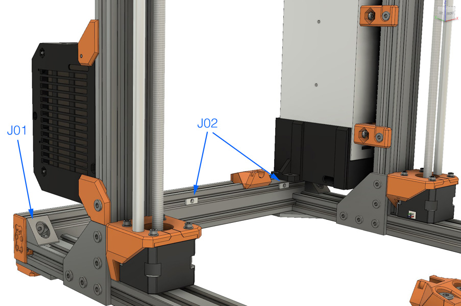
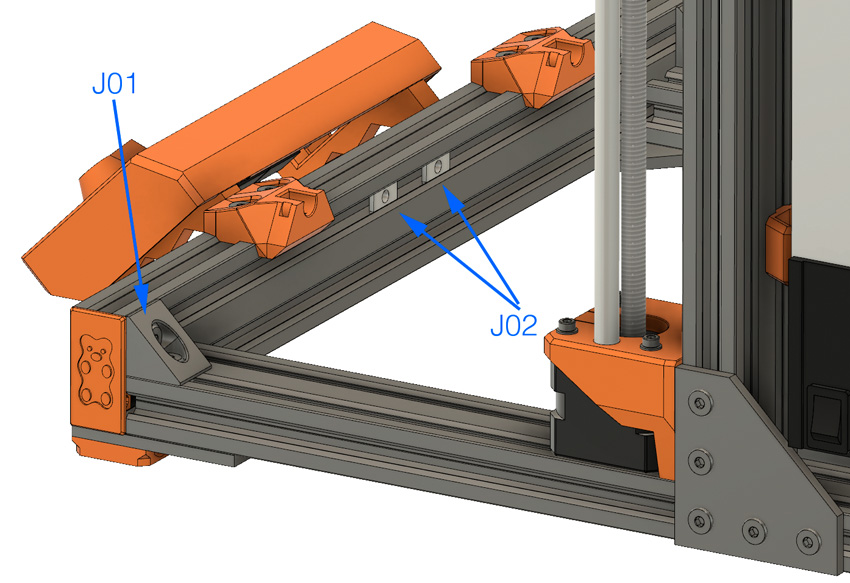

# Bear Upgrade 2.1

## Temporary assembly guide for new parts of Bear Upgrade 2.1

### Warning :warning:

Please refer to assembly guide for Bear Upgrade 2.0 for the complete assembly.

This is only covering temporarily the new features of Bear Upgrade 2.1.

:warning: Those instructions are for advanced users, if you are not sure how to proceed, please wait the final release.

### Removing unused t-nuts

You will need to remove some t-nuts that are blocked by the black angle corner. Follow these instructions to remove them properly.

:bulb: Those are images from MK3 frame but use the same idea for Bear Upgrade MK2S, MK2.5 frame.

  1. Remove the end caps.
  1. **J01:** Remove top screw and t-nut of one black angle corner on the Y idler or Y motor side.
  1. **J02:** Remove the t-nut(s) that are in the top row.
  1. **K01:** Retighten the black angle corner and verify the frame is still flat. If necessary, add something in the corner and press the frame on opposite corners to make it flat again.
