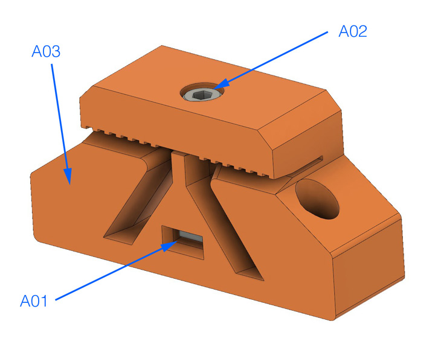
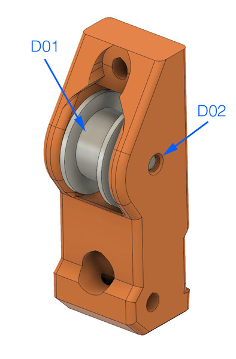
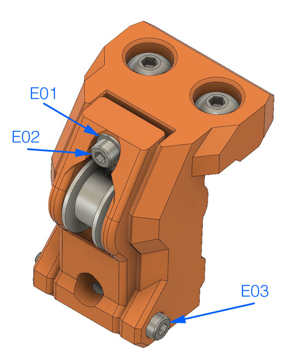
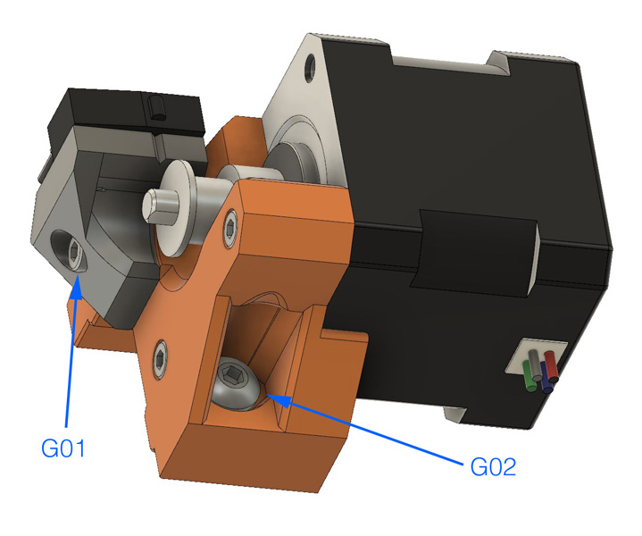
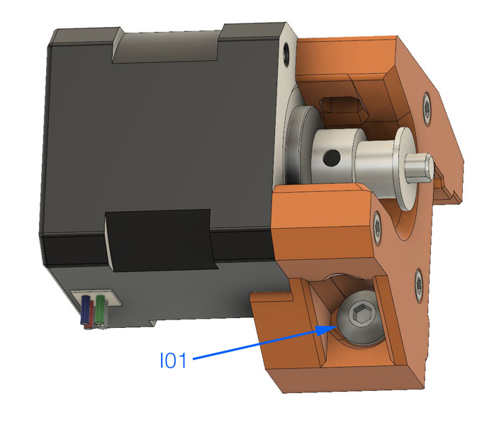

# Bear Upgrade 2.1

## Temporary assembly guide for new parts of Bear Upgrade 2.1

### Warning :warning:

Please refer to assembly guide for Bear Upgrade 2.0 for the complete assembly.

This is only covering temporarily the new features of Bear Upgrade 2.1.

:warning: Those instructions are for advanced users, if you are not sure how to proceed, please wait the final release.

### Y Axis

#### Parts that needs to be printed

  1. y_idler_mount
  1. y_idler_tensioner
  1. y_belt_holder
  1. y_motor_mount
  1. y_motor_endstop_mount (MK2S, MK2.5(S) only)

#### Parts positions on the frame

  * For Bear Upgrade 2.1 MK3(S) : [doc/bear_upgrade_2.1_parts_positions_mk3-3s.pdf](../../doc/bear_upgrade_2.1_parts_positions_mk3-3s.pdf)
  * For Bear Upgrade 2.1 MK2S, MK2.5(S) : [doc/bear_upgrade_2.1_parts_positions_mk2s-2.5-2.5s.pdf](../../bear_upgrade_2.1_parts_positions_mk2s-2.5-2.5s.pdf)

#### Y Belt Holder

  * **A01:** M3 square nut
  * **A02:** M3x18mm
  * **A03:** This face must face the two bearings side of the Y carriage

Insert the belt and secure it with A02.

#### Y Idler

* **B01:** M5x10mm
* **B02:** M5x10mm
* **B02:** M3 locknut

* **C01:** M3 locknut

* **D01:** Prusa 20T smooth idler
* **D02:** Dowel pin

* **E01:** M3 washer
* **E02:** M3x25mm
* **E03:** M3x30mm

Try to keep the tensioner as closed as possible. Move the belt by 1 or two teeth from the Y belt holder if necessary.

# Y Motor Mount MK2S, MK2.5(S)

* **F01:** M5x12mm
* **F02:** M3x10mm
* **F03:** M2x12mm
* **F04:** M3x18mm
* **F05:** Align the endstop pin with the slit

Press the motor in the direction of the vslot when tightening F02 and F04 screws.

* **G01:** M3x10mm
* **G02:** M5x16mm

# Y Motor Mount MK3(S)

* **H01:** M5x12mm
* **H02:** M3x18mm

Press the motor in the direction of the vslot when tightening H02 screws.

* **I01:** M5x16mm
