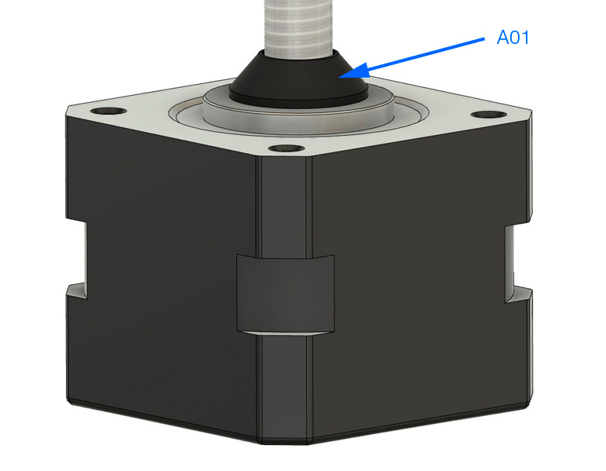
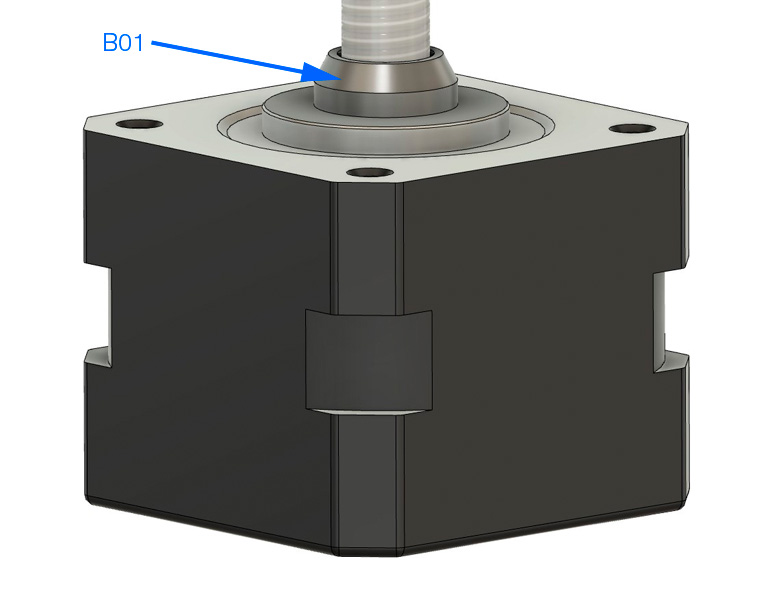
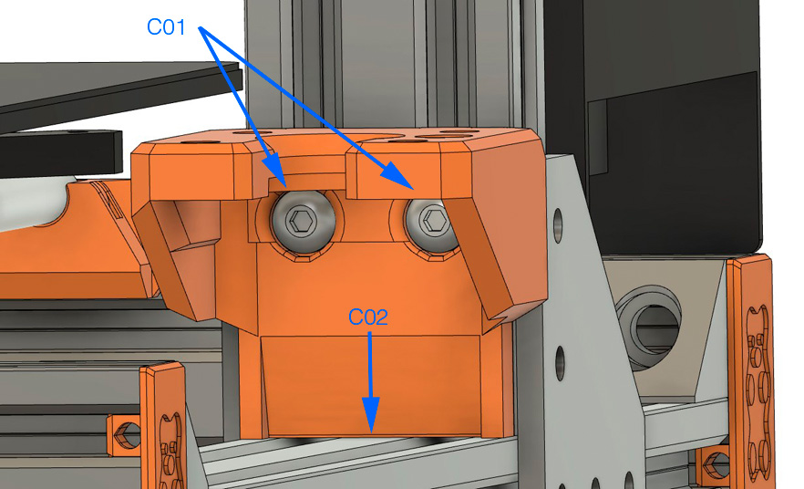
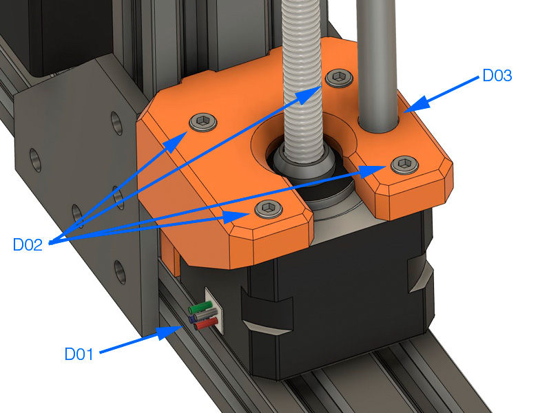
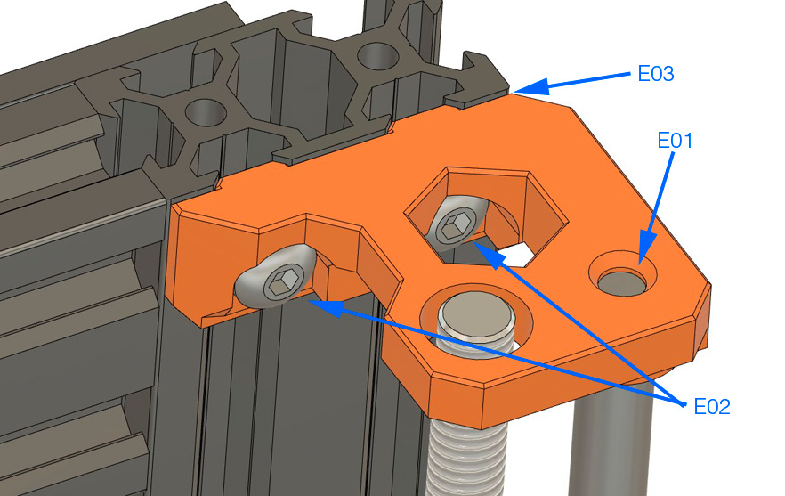

# Bear Upgrade 2.1

## Temporary assembly guide for new parts of Bear Upgrade 2.1

### Warning :warning:

Please refer to assembly guide for Bear Upgrade 2.0 for the complete assembly.

This is only covering temporarily the new features of Bear Upgrade 2.1.

:warning: Those instructions are for advanced users, if you are not sure how to proceed, please wait the final release.

### Z Axis

#### Parts that needs to be printed

  1. z_leadscrew_cap
  1. z_motor_mounts
  1. z_tops

#### Disassemble X and Z axis

1. Remove the z-tops off the smooth rods.
2. Remove the trapezoidal nuts of each x-end and spin those nuts to the top of the lead screws and remove them.
3. Remove completely the X axis. Alternatively you can hang the X axis on the Z top extrusion with two strings.
4. Remove the Z motors completely.
5. Remove the Z motor mounts.

#### Z leadscrew cap

  * **A01:** Remove the original Z leadscrew cap.

  * **B01:** Install the new Z leadscrew cap. Make sure to not push dust into the stepper. To avoid this, clean the leadscrew when the new Z leadscrew cap are close to the motor.

#### Z motor z_motor_mounts

  * **C01:** M5x10mm
  * **C02:** Make sure the Z motor mount is flushed with the extrusion.

  * **D01:** Insert the stepper with cable oriented toward the heated bed.
  * **D02:** M3x10mm. :warning: The previous Z motor mount was using M3x__12mm__ screws!
  * **D03:** Insert the smooth rod to the stepper (it should touch the stepper).

#### Z tops

  * **E01:** Insert the Z top until the smooth rod touch the top of the smooth rod hole.
  * **E02:** M5x10mm.
  * **E03:** Ensure your Z top is parallel to top of extrusion. It is possible that you have a bit more spacing with the previous Z axis, we have increased clearance with the top of extrusion.
