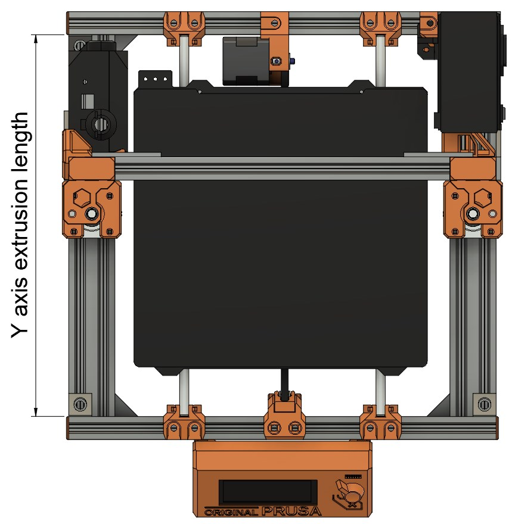

# Frame Upgrade 2.1

## Bear 2.1 upgrade parts for Full Bear 2.0 MK2(S)/MK2.5(S) frame

### Introduction

These parts allow you to upgrade your __Full Bear 2.0 MK2(S)/MK2.5(S) frame__ to similar parts than Bear 2.1. The new Bear 2.1 frame is based on the Full Bear 2.0 MK3 frame and is longer and taller than Full Bear 2.0 MK2(S)/MK2.5(S) frame.

These parts are __not__ compatible with Bear __2.1__ frame __for__ MK2(S)/MK2.5(S).

### Printed parts

You need to check the length of the frame to be sure you are getting the correct printed parts.

Measure the length of your Y axis __extrusion__ as seen on the picture below.
  * The length is __311 mm long__ (±1mm):
    * This is the old and shorter Bear 2.0 MK2 MK2.5 frame. You need special parts.
    * [Download this ZIP file](../../../../releases/latest/download/bear21_optional_parts.zip), STL are in the folder `bear_2.0_upgrade_mk2-2s-2.5-2.5s/printed_parts/stl`.
  * If the length is __331 mm long__ (±1mm):
    * You have the latest Bear frame, same extrusion as the standard Bear Frame 2.1. Follow the links from the [main page](../../README.md)

### Print settings

Use the same print settings as the standard Bear 2.1 kit. You can [read them here](../../manual/print_settings.md).

### Manual

Use the same assembly guide than the standard Bear 2.1 here: [Bear 2.1 manual](https://guides.bear-lab.com/c/Frame).
