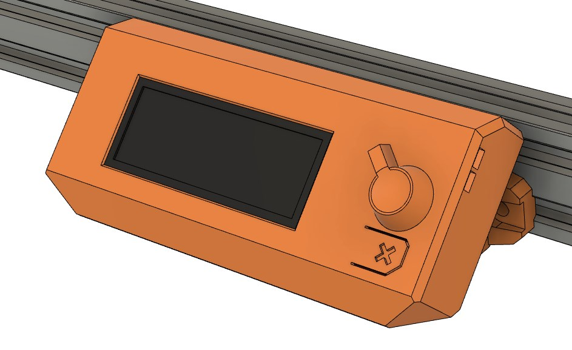
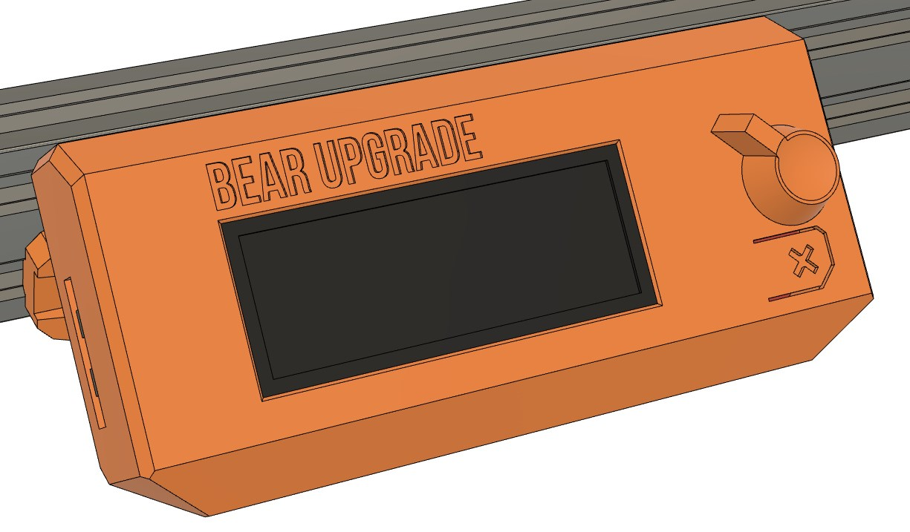
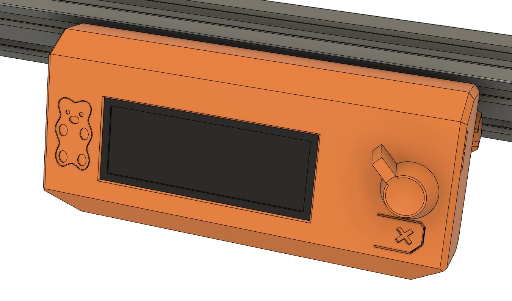
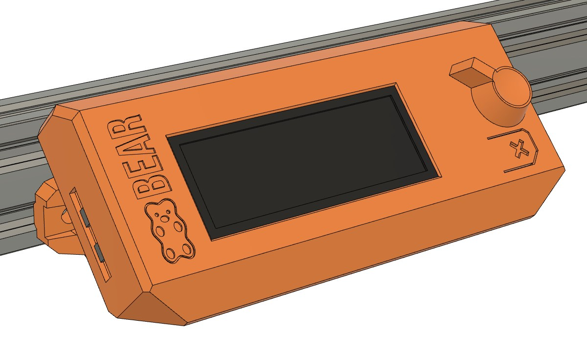
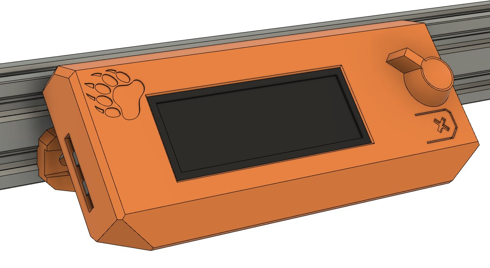

# Bear Upgrade 2.1

## LCD Cover

### Introduction

This is an alternative LCD cover specially designed for Bear Upgrade frame.
  * New accurate design from scratch
  * Makes the frame shorter thanks to a bevel in front
  * Eliminate vibrations by using 4 screws to mount the PCB
  * Easier to rotate LCD knob
  * Quicker to print and use less filament
  * Sleek design for better look
  * Design improved for best print quality
  * Available without ornament, with logo, with text, with logo+text and with Bear Paw logo (requested by LGBT community as it is one of their symbol)

### Images

#### Simple version

#### Text only version

#### Logo only version

#### Text and logo version

#### LGBT Bear Paw version

### Bill of Materials

#### Hardware

| Part     | Quantity | Detail |
|----------|:--------:|--------|
| Original Prusa LCD unit  | 1 | [Prusa store link](https://shop.prusa3d.com/en/spare-parts/213-lcd-unit.html) |
| M3x10mm socket head screw ISO 4762 | 4 | |

#### Printed parts

| Part     | Qty | Note | Download link |
|----------|:--------:|------|---------------|
| lcd_cover     | 1 | Choose one between different designs | [lcd_cover.stl](https://github.com/gregsaun/prusa_i3_bear_upgrade/raw/dev/optional_parts/lcd_cover/printed_parts/stl/lcd_cover.stl) [lcd_cover_text.stl](https://github.com/gregsaun/prusa_i3_bear_upgrade/raw/dev/optional_parts/lcd_cover/printed_parts/stl/lcd_cover_text.stl) [lcd_cover_logo.stl](https://github.com/gregsaun/prusa_i3_bear_upgrade/raw/dev/optional_parts/lcd_cover/printed_parts/stl/lcd_cover_logo.stl) [lcd_cover_logo_text.stl](https://github.com/gregsaun/prusa_i3_bear_upgrade/raw/dev/optional_parts/lcd_cover/printed_parts/stl/lcd_cover_logo_text.stl) [lcd_cover_lgbt_bear_paw.stl](https://github.com/gregsaun/prusa_i3_bear_upgrade/raw/dev/optional_parts/lcd_cover/printed_parts/stl/lcd_cover_lgbt_bear_paw.stl) |
| lcd_knob      | 1 | | [lcd_knob.stl](https://github.com/gregsaun/prusa_i3_bear_upgrade/raw/dev/optional_parts/lcd_cover/printed_parts/stl/lcd_knob.stl) |
| lcd_support_a | 1 | | [lcd_support_a.stl](https://github.com/gregsaun/prusa_i3_bear_upgrade/raw/dev/optional_parts/lcd_cover/printed_parts/stl/lcd_support_a.stl) |
| lcd_support_b | 1 | | [lcd_support_b.stl](https://github.com/gregsaun/prusa_i3_bear_upgrade/raw/dev/optional_parts/lcd_cover/printed_parts/stl/lcd_support_b.stl) |

### Print Settings

#### :warning: Warning

1. The parts have been designed and tested with the parameters below and it is important to follow them to avoid issues like part cracking, bad bridging, not enough stiffness or wrong tolerances.
1. Be sure to have a well calibrated machine and extruder. Check our guide here for [calibrating extrusion multiplier](https://guides.bear-lab.com/Guide/Extrusion+multiplier+and+filament+diameter/8?lang=en)

#### Parameters

* Filament type: PETG
* Slicer: PrusaSlicer
* Infill type : Gyroid recommended
* Support : No
* Brim : No
* Detect thin walls : No
* Perimeters width (internal and external) : 0.45mm

| Part | Layer Height [mm] | Infill [%] | Num. Perimeters | Num. Top/Bottom Layers |
|:----|:----:|:----:|:----:|:----:|
| lcd_cover   | 0.20 | 20 | 3 | 5 |
| lcd_support | 0.20 | 20 | 3 | 5 |
| lcd_knob    | 0.20 | 20 | 3 | 5 |
