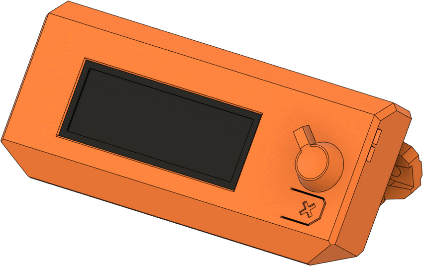
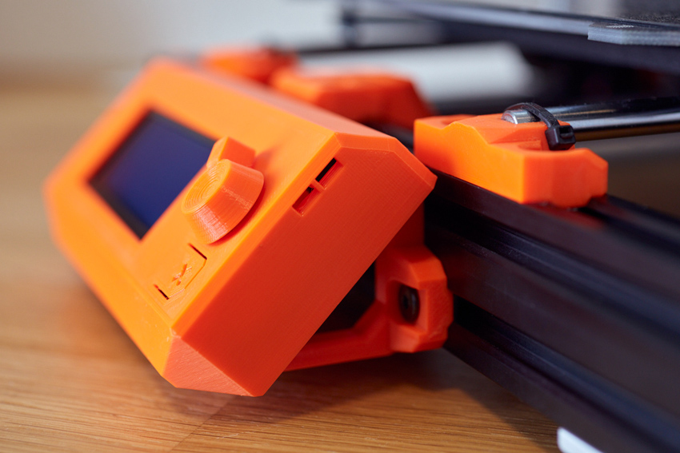
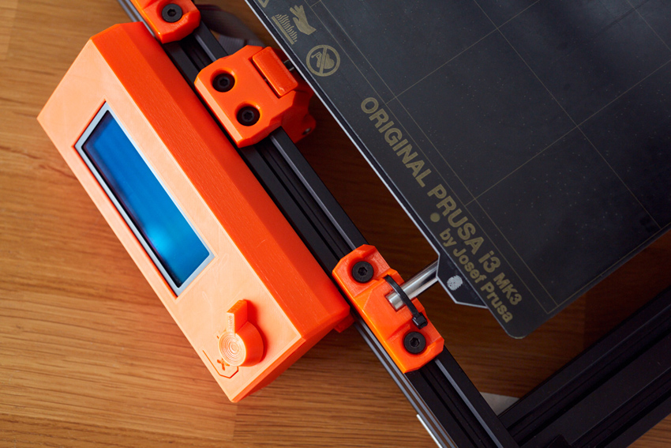
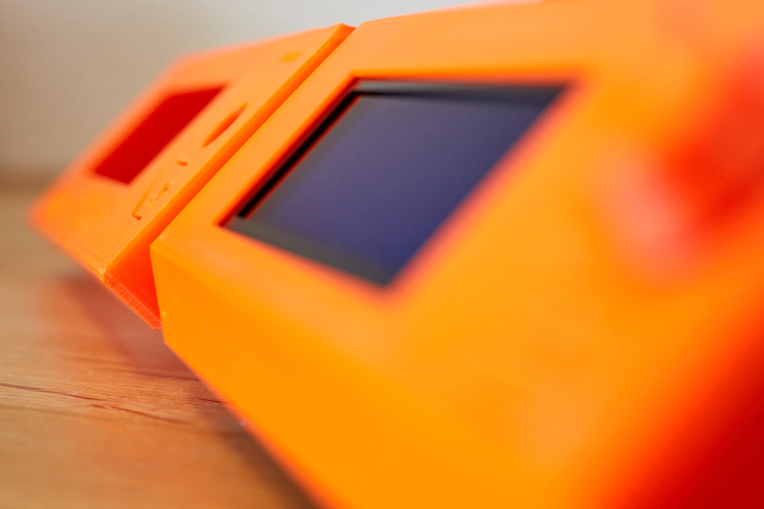
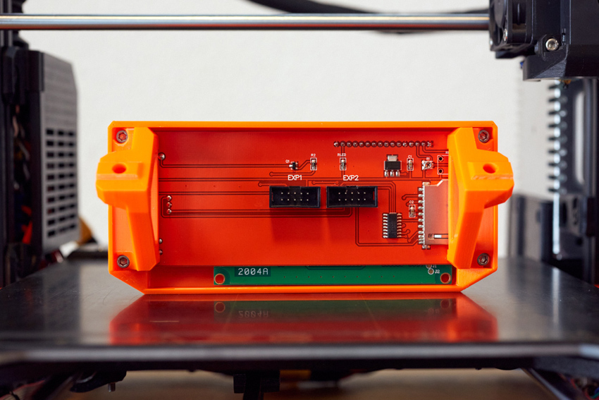

# Bear Frame Upgrade 2.1

## LCD Cover

### Table of contents
  1. [Introduction](#introduction)
  1. [Pictures](#pictures)
  1. [Compatibility](#compatibility)
  1. [Bill of materials](#bill-of-materials)
  1. [Printed parts](#printed-parts)
  1. [Print settings](#print-settings)

### Introduction

This is an alternative LCD cover designed for the Bear Frame Upgrade.
  * New accurate design from scratch
  * Shorter frame thanks to a bevel at the front (4th picture)
  * Elimination of vibrations by using 4 screws to attach the LCD
  * Easier rotation of the LCD knob
  * Faster to print while using less filament
  * Sleek design for better look
  * Improved design for best print quality
  * Optional: LCD supports compatible with stock Prusa MK3(S) frame
  * Available in several looks:
      * Simple without text or logo
      * Bear logo
      * Bear Upgrade text
      * Bear logo and text
      * Bear Paw logo

:bulb: The Bear Paw logo is a special design for the LGBT community because it is one of their symbols. You can find more details about it here: https://en.wikipedia.org/wiki/Bear_flag_(gay_culture)

### Pictures

# Compatibility

This Bear LCD cover is compatible with all Bear Frame Upgrades. It is also compatible with the Original Prusa MK3(S) frame (see section [Printed parts](#printed-parts)).

### Bill of materials

| Part     | Quantity | Detail |
|----------|:--------:|--------|
| Original Prusa LCD unit            | 1 | [Prusa store link](https://shop.prusa3d.com/en/spare-parts/213-lcd-unit.html) |
| M3x10mm socket head screw ISO 4762 | 4 | |

### Printed parts

| Part | Qty | Note | Download link |
|------|:---:|------|---------------|
| lcd_cover           | 1 |  Choose one of the available designs (check the GIF on top) | [lcd_cover.stl](printed_parts/stl/lcd_cover.stl?raw=true) [lcd_cover_text.stl](printed_parts/stl/lcd_cover_text.stl?raw=true) [lcd_cover_logo.stl](printed_parts/stl/lcd_cover_logo.stl?raw=true) [lcd_cover_logo_text.stl](printed_parts/stl/lcd_cover_logo_text.stl?raw=true) [lcd_cover_lgbt_bear_paw.stl](printed_parts/stl/lcd_cover_lgbt_bear_paw.stl?raw=true) |
| lcd_knob            | 1 | | [lcd_knob.stl](printed_parts/stl/lcd_knob.stl?raw=true) |
| lcd_support_a       | 1 | For **Bear frame** | [lcd_support_a.stl](printed_parts/stl/lcd_support_a.stl?raw=true) |
| lcd_support_b       | 1 | For **Bear frame** | [lcd_support_b.stl](printed_parts/stl/lcd_support_b.stl?raw=true) |
| lcd_support_a_prusa | 1 | For **Original Prusa frame** | [lcd_support_a_prusa.stl](printed_parts/stl/lcd_support_a_prusa.stl?raw=true) |
| lcd_support_b_prusa | 1 | For **Original Prusa frame** | [lcd_support_b_prusa.stl](printed_parts/stl/lcd_support_b_prusa.stl?raw=true) |

### Print settings

:warning: Warning: It is important to follow the recommended print settings and to **calibrate your extrusion multiplier** before printing the parts (for each and every spool that you use). [Check our calibration guide here](https://guides.bear-lab.com/Guide/Extrusion+multiplier+and+filament+diameter/8).

  * Slicer : PrusaSlicer recommended
  * Infill type : Gyroid recommended
  * Support : No
  * Brim : No
  * Detect thin walls : No
  * Perimeters width : 0.45mm

| Part | Layer Height [mm] | Infill [%] | Num. Perimeters | Num. Top/Bottom Layers |
|:-----|:-------------------------:|:----------:|:-------------------:|:------------------------------:|
| lcd_cover   | 0.20 | 20 | 3 | 5 |
| lcd_support | 0.20 | 20 | 3 | 5 |
| lcd_knob    | 0.20 | 20 | 3 | 5 |

### Credit

The bear paw logo has been designed by Solipandi Designs: https://www.etsy.com/listing/487103775/bear-paw-svg-cut-files-svg-and-dxf-cut
