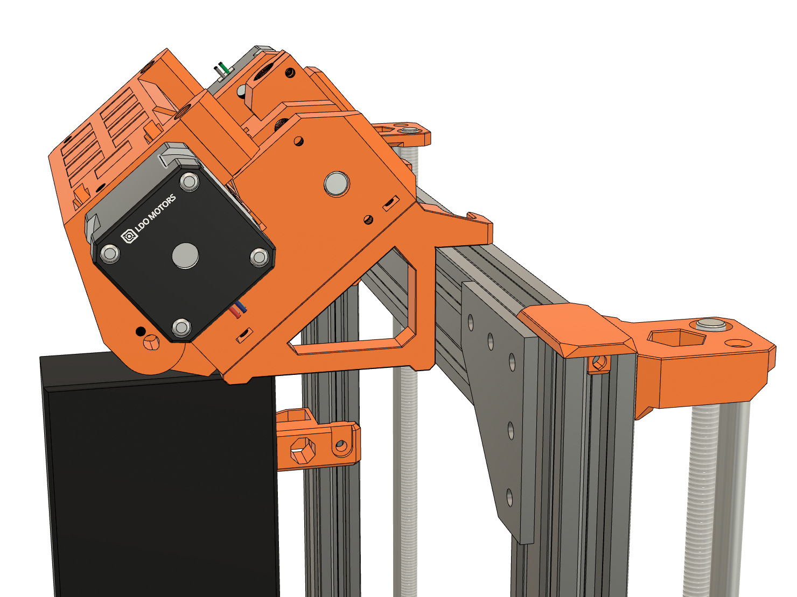
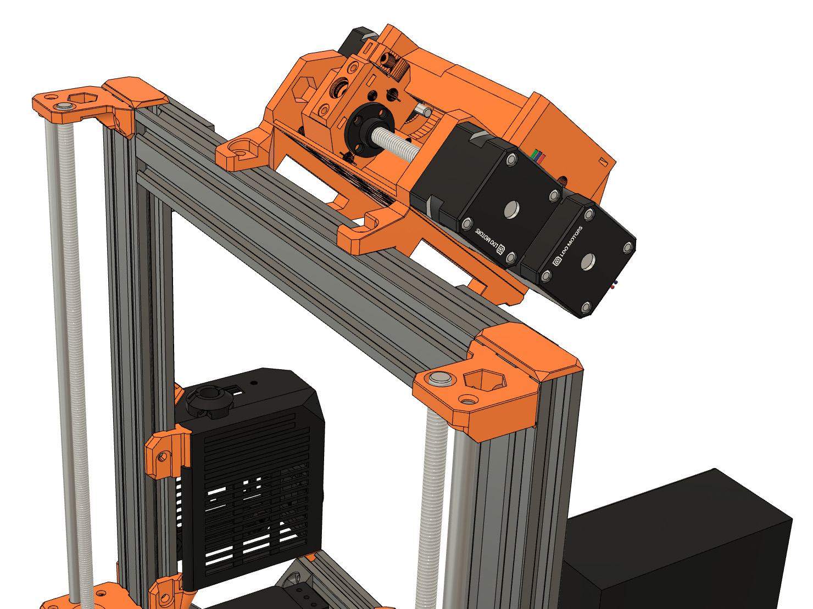

# Bear Upgrade 2.1

## MMU2(S) Frame Holder for Bear Frame

### Table of contents
  1. [Introduction](#introduction)
  1. [Pictures](#pictures)
  1. [Compatibility](#compatibility)
  1. [Bill of materials](#bill-of-materials)
  1. [Printed parts](#printed-parts)
  1. [Print Settings](#print-settings)

### Introduction

MMU2 and MMU2S frame holder for my Bear Upgrade.

### Pictures

### Compatibility

This MMU2(S) frame holder is compatible with both MMU2 and MMU2S

### Bill of materials

| Part     | Quantity | Example |
|----------|:--------:|--------|
| M5x10mm button head screw (ISO 7380) | 2 | |
| Drop-in tee-nuts M5 | 2 | [Openbuilds](https://openbuildspartstore.com/spring-loaded-tee-nuts/) |

### Printed parts

Use this link to download the STL: [mmu2_frame_holder.stl](printed_parts/mmu2_frame_holder.stl?raw=true)

### Print settings

:warning: Warning: The parts have been designed and tested with the parameters below and it is important to follow them to avoid issues like part cracking, bad bridging, not enough stiffness or wrong tolerances. Be sure to have a well calibrated machine and extruder. Check our guide here for [calibrating extrusion multiplier](https://guides.bear-lab.com/Guide/Extrusion+multiplier+and+filament+diameter/8?lang=en)

  * Slicer : PrusaSlicer recommended
  * Infill type : Gyroid recommended
  * Support : No
  * Brim : No
  * Detect thin walls : No
  * Perimeters width (internal and external) : 0.45mm

| Layer Height | Infill | Perimeters | Top/Bottom Layers |
|:----:|:----:|:----:|:----:|
| 0.20mm | 20% | 3-4 | 5 |
