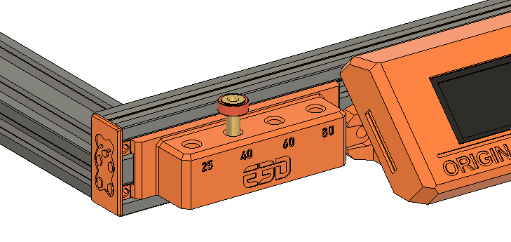

# Bear Frame Upgrade 2.1

## Revo Nozzle Holder

### Introduction

This is a simple slide-in holder for your E3D Revo series of nozzles.
It can be installed within a minute, as it only requires you to remove the extrusion endcap.

### Printed parts

:pushpin: If you have any doubt as to which Bear frame you have, please check the [Bear FAQ here](https://guides.bear-lab.com/Wiki/Bear_FAQ#Section_Which_Bear_frame_do_I_have).

:warning: Warning: It is important to follow the recommended print settings and to **calibrate your extrusion multiplier** before printing the parts (for each and every spool that you use). [Check our calibration guide here](https://guides.bear-lab.com/Guide/Extrusion+multiplier+and+filament+diameter/8).

| Part     | Qty | Note | Download link |
|----------|:---:|------|---------------|
| revo_nozzle_holder_bear_v23 | 1 | For Bear 2.1 frame | [revo_nozzle_holder_bear_v23.stl](printed_parts/revo_nozzle_holder_bear_v23.stl?raw=true) |

### Print settings

:warning: Warning: It is important to follow the recommended print settings and to **calibrate your extrusion multiplier** before printing the parts (for each and every spool that you use). [Check our calibration guide here](https://guides.bear-lab.com/Guide/Extrusion+multiplier+and+filament+diameter/8).

  * Slicer : PrusaSlicer recommended
  * Infill type : Gyroid recommended
  * Support : No
  * Brim : No
  * Detect thin walls : No
  * Perimeters width (internal and external) : 0.45mm

| Part | Layer Height [mm] | Infill [%] | Num. Perimeters | Num. Top/Bottom Layers |
|:-----|:-------------------------:|:----------:|:-------------------:|:------------------------------:|
| y_belt_holder_9mm_belt_X   | 0.20 | 15-20 | 2 | 5 |

### Assembly instructions

- Remove the front left extrusion end cap
- Slide the holder into the front extrusion until it touches the LCD cover on the left
- Re-install the extrusion end cap

**(The nozzle holder will fill the gap between the end cap and the LCD exactly, so you can also use this nozzle holder to align your LCD!)**