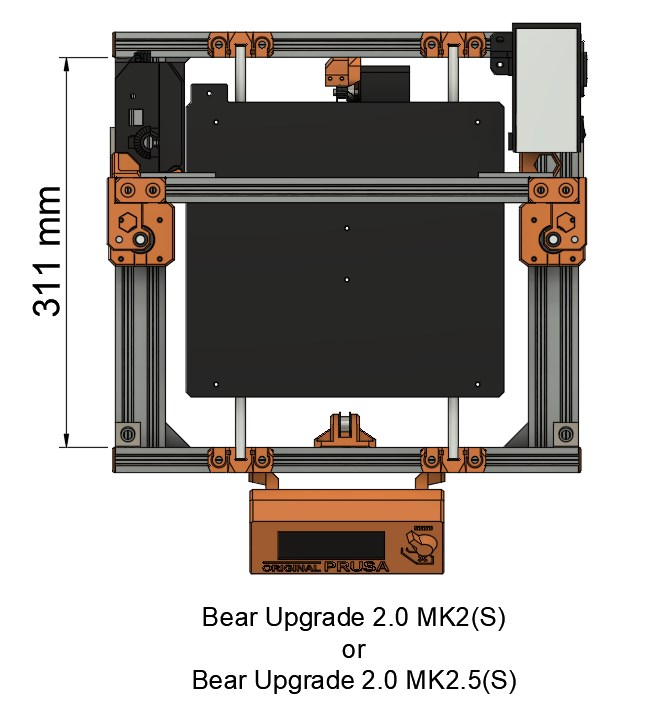

# Prusa i3 Bear Upgrade 2.1

## Y Belt Holder For Bear 2.0 MK2(S) and MK2.5(S) frame

### Introduction

This Y belt holder is needed if you would like to use Bear 2.1 Y axis on a Full Bear 2.0 MK2(S) or MK2.5(S) frame.

The new Bear 2.1 frame is based on the Bear 2.0 MK3 frame and is longer.

### Which frame do I have?

Measure the length of your Y axis **extrusion** as seen on the picture below.
  * If the length is **311 mm long** (±1mm) then you need the Y belt holder listed in this page.
  * If the length is **331 mm long** (±1mm) then you can use the standard Bear 2.1 Y axis from [here](../../printed_parts/).

### Print settings and assembly

You have to use the same print settings and assembly guide than the standard Bear 2.1 Y belt holder. Here is the [Bear 2.1 manual](../../manual).

### Download

Direct link to download the STL: [y_belt_holder_bear2.0_mk2s-2.5-2.5s.stl](https://github.com/gregsaun/prusa_i3_bear_upgrade/raw/dev/optional_parts/y_belt_holder_for_bear2.0_mk2s_mk2.5_mk2.5s/y_belt_holder_bear2.0_mk2s-2.5-2.5s.stl)
