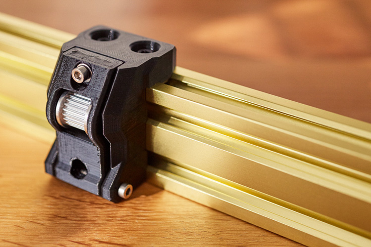

# Bear Frame Upgrade 2.1

## Y idler for 9mm belts

### Introduction

This is a Y idler for 9mm wide Gates 2GT belt (standard is 6mm). Larger belts will have less flex and might reduce ringing.

### Bill of Materials

| Part     | Quantity | Detail |
|----------|:--------:|--------|
| E3D Gates 2GT 9mm Belt                                       | 1 | [E3D store link](https://e3d-online.com/gates-powergripr-gt2-belt-9mm-x-100mm) |
| E3D Gates 2GT Toothed Idler 9mm Belt, 20 Tooth, 5mm bore | 1 | [E3D store link](https://e3d-online.com/products/gates-powergrip%C2%AE-2gt-idlers) |
| 2GT Pulley 16T, 5mm bore                                     | 1 | [Aliexpress Powge store](https://www.aliexpress.com/item/32995138803.html) |
| Dowel pin diameter: 4.90-4.95mm length: 20mm         | 1 | Must fit the 2GT idler bearing. :pushpin: Cut a M5 screw if you can't find one |
| M3x30mm socket head screw ISO 4762                           | 1 | |
| M3x25mm socket head screw ISO 4762                           | 1 | |
| M3 Hex nylock nuts (DIN 985)                                 | 2 | |
| M3 steel washer DIN 125, 0.5mm thick                         | 1 | |

### Printed parts

:pushpin: If you have any doubt as to which Bear frame you have, please check the [Bear FAQ here](https://guides.bear-lab.com/Wiki/Bear_FAQ#Section_Which_Bear_frame_do_I_have).

:warning: Warning: It is important to follow the recommended print settings and to **calibrate your extrusion multiplier** before printing the parts (for each and every spool that you use). [Check our calibration guide here](https://guides.bear-lab.com/Guide/Extrusion+multiplier+and+filament+diameter/8).

| Part     | Qty | Note | Download link |
|----------|:---:|------|---------------|
| y_belt_holder_9mm_belt_bear2.0_mk2s-2.5-2.5s | 1 | :warning: For Bear 2.0 MK2(S), MK2.5(S) frame | [y_belt_holder_9mm_belt_bear2.0_mk2s-2.5-2.5s.stl](printed_parts/y_belt_holder_9mm_belt_bear2.0_mk2s-2.5-2.5s.stl?raw=true) |
| y_belt_holder_9mm_belt_bear2.1_mk2s-2.5-2.5s | 1 | :warning: For Bear 2.1 MK2(S), MK2.5(S) frame | [y_belt_holder_9mm_belt_bear2.1_mk2s-2.5-2.5s.stl](printed_parts/y_belt_holder_9mm_belt_bear2.1_mk2s-2.5-2.5s.stl?raw=true) |
| y_belt_holder_9mm_belt_bear2.1_mk3-3s        | 1 | :warning: For Bear 2.1 MK3(S) frame | [y_belt_holder_9mm_belt_bear2.1_mk3-3s.stl](printed_parts/y_belt_holder_9mm_belt_bear2.1_mk3-3s.stl?raw=true) |
| y_idler_mount_9mm_belt                       | 1 | | [y_idler_mount_9mm_belt.stl](printed_parts/y_idler_mount_9mm_belt.stl?raw=true) |
| y_idler_tensioner_9mm_belt                   | 1 | | [y_idler_tensioner_9mm_belt.stl](printed_parts/y_idler_tensioner_9mm_belt.stl?raw=true) |

The Y motor mount from the standard Bear Frame 2.1 printed parts is reused.

### Print settings

:warning: Warning: It is important to follow the recommended print settings and to **calibrate your extrusion multiplier** before printing the parts (for each and every spool that you use). [Check our calibration guide here](https://guides.bear-lab.com/Guide/Extrusion+multiplier+and+filament+diameter/8).

  * Slicer : PrusaSlicer recommended
  * Infill type : Gyroid recommended
  * Support : No
  * Brim : No
  * Detect thin walls : No
  * Perimeters width (internal and external) : 0.45mm

| Part | Layer Height [mm] | Infill [%] | Num. Perimeters | Num. Top/Bottom Layers |
|:-----|:-------------------------:|:----------:|:-------------------:|:------------------------------:|
| y_belt_holder_9mm_belt_X   | 0.20 | 20 | 4 | 5 |
| y_idler_mount_9mm_belt     | 0.20 | 20 | 4 | 5 |
| y_idler_tensioner_9mm_belt | 0.20 | 20 | 4 | 5 |

### Assembly instructions

Follow the same assembly instructions as for the standard Bear 2.1 Y idler.
